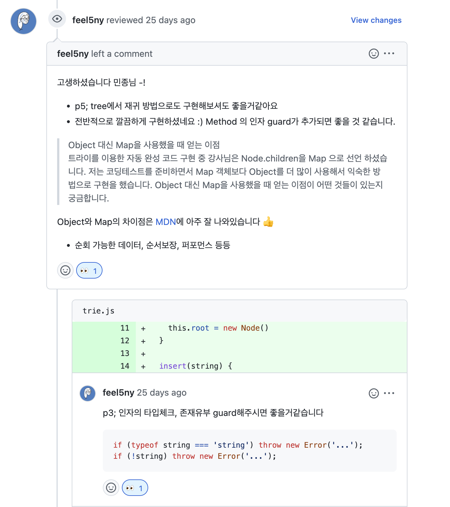
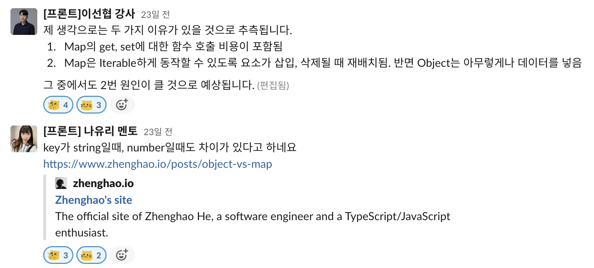
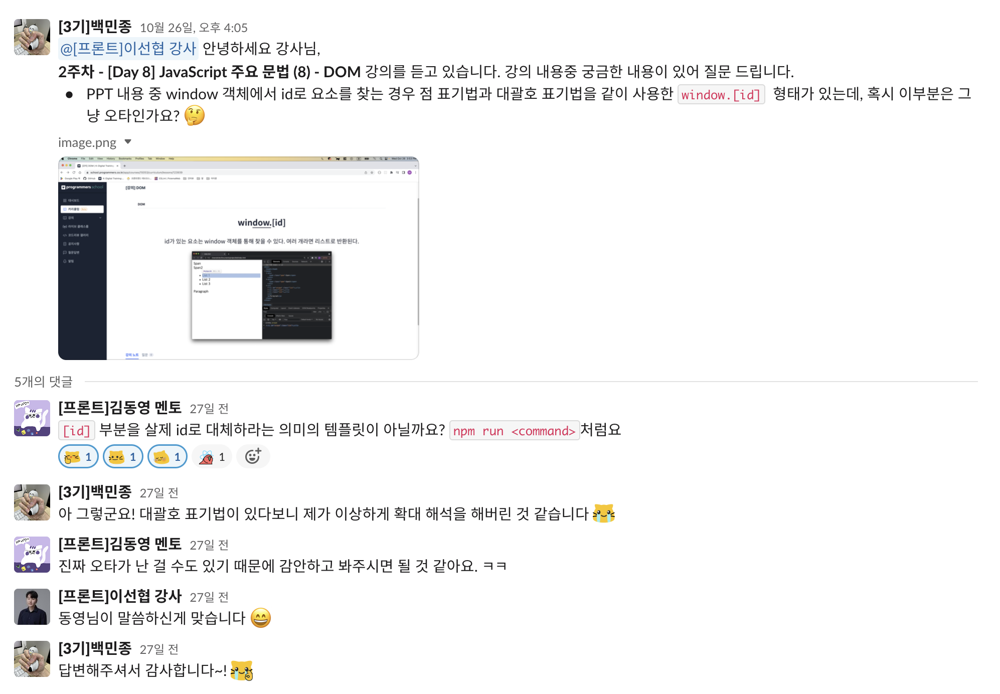
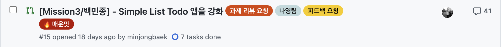
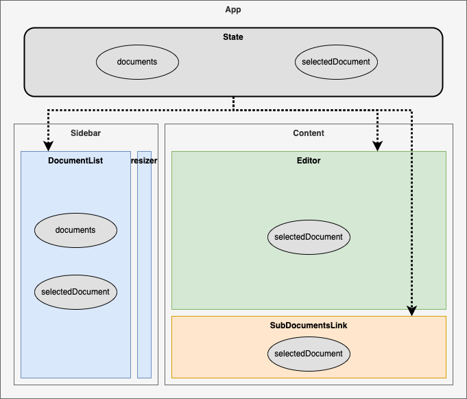
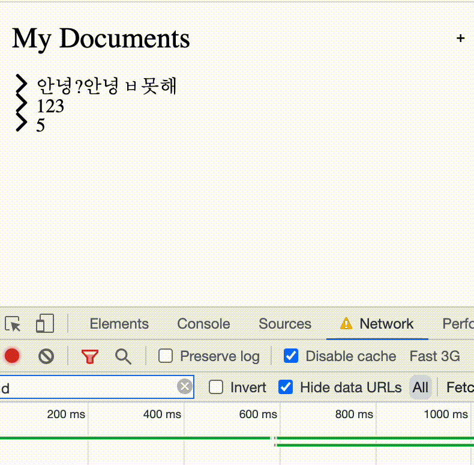
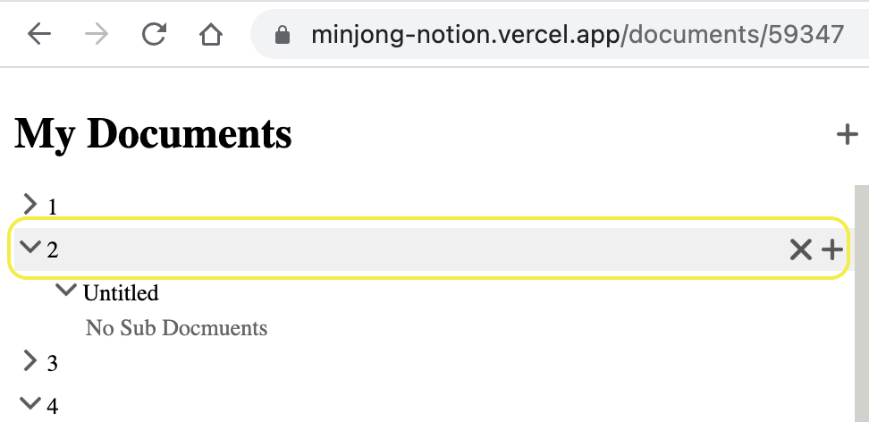
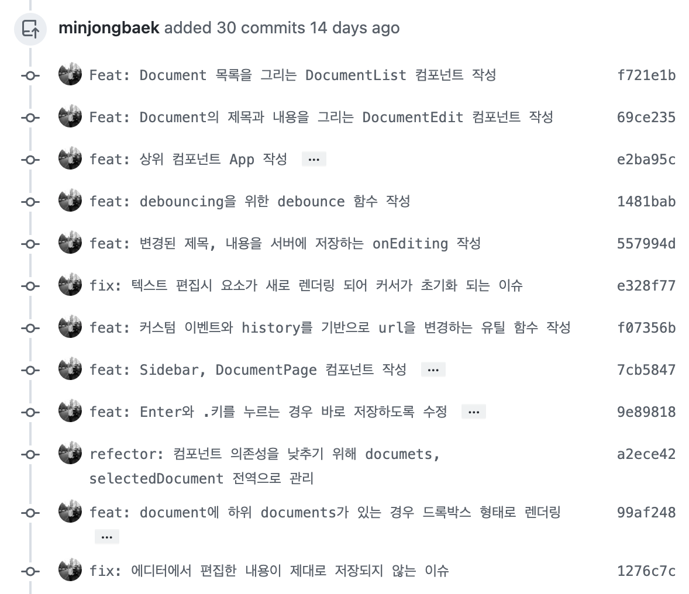
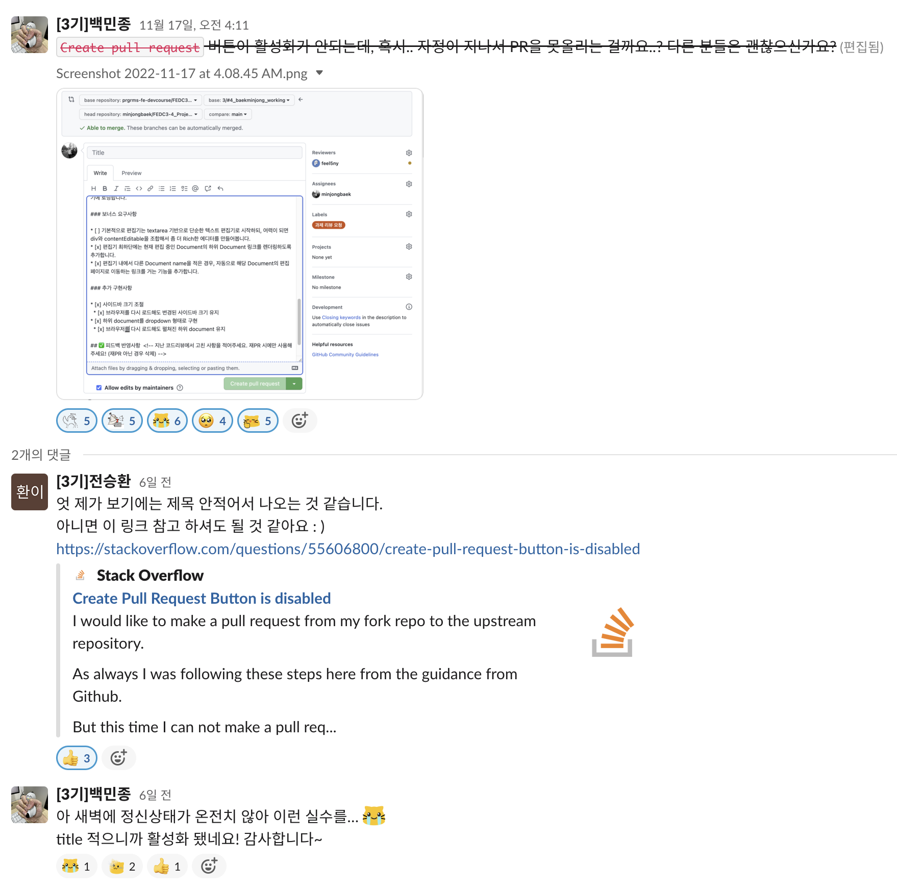

# 0주 차

약 2년 8개월간 백엔드 개발자로 근무하면서 느낀 것이 있다면 지속 가능한 개발자가 되어야 한다는 것이다.

기능을 구현할 때 필요한 기술을 학습하기보다는 검색, 복사, 붙여 넣기 후에 ‘이렇게 하니까 되는구나~’ 하고 대충 넘겼다. 결국 이직할 때가 되어서 몇몇 회사에 이력서를 넣고, 면접을 보면서 나는 시장에서 가치 있는 개발자가 아니라는 것을 깨닫게 되었다.

내가 만든 결과물로 사람들에게 이로운 경험을 제공하고 싶어 개발자가 되었는데 당시 내 모습은 내가 되고 싶어 하는 개발자와는 거리가 멀었다. 뭔가 많이 했지만 깊게 아는 것은 딱히 없고, 내세울 만한 포트폴리오 하나 없었다.

이런저런 생각을 하다가 결국 퇴사를 결심했고, 이전과 같은 실수를 반복하지 않겠다고 다짐하며 프론트엔드 개발에 필요한 기술을 혼자서 학습해왔다.

혼자서 학습하는 것은 생각보다 어려웠다. 책이나 문서를 보고 필요한 기술을 학습한 뒤에 기능을 구현해도 내가 올바르게 이해했는지, 내가 작성한 코드에 문제는 없는지 확인할 방법이 없었다.

커뮤니케이션을 통한 학습의 필요성을 절실하게 느끼던 중 운 좋게 프로그래머스 프론트엔드 데브코스에 참여할 수 있었다.

# 1~2주 차 - **JavaScript 주요 문법**

- 기초 CS
- 자료구조, 알고리즘
- 자바스크립트 주요 개념
- DOM

1~2 주 차의 타이틀은 자바스크립트의 주요 문법이지만, 위 목록에 있는 내용을 폭넓게 학습할 수 있었다.

첫째, 둘째 날 ‘생각보다 학습할 내용이 많지 않은데?’라고 생각했지만, 셋째 날 자료구조와 알고리즘 파트를 들어가면서 ‘어..? 쉽지 않은데?’라고 생각했다.

2주 차가 됐을 때는 프로그래머스 코딩 테스트 레벨 3, 4 정도 문제를 손쉽게 푸는 강사님은 코딩 테스트의 신이 아닐까 생각했다. ~~나는 아직도 입국심사 문제를 어떻게 이진 탐색으로 풀 수 있던 것인지 감도 못 잡겠다.~~

**그리고, 1주 차부터 과제가 있었다.**

요구사항은 트리와 트라이 자료구조를 이용해 간단한 기능을 구현하는 것이었고, 첫 과제를 하면서 **꼭 코드 리뷰를 하는 회사를 가야겠다**고 생각했다.



학습을 진행하면서 궁금한 내용이 있는 경우에는 강사님과 멘토님께서 친절하게 지식을 공유해주셨다. [Map과 Object의 성능을 비교](/compare-map-and-object)하면서 왜 나는 테스트 결과가 이상하지? 라고 생각했는데 명쾌하게 해결해주셨다.



<details>
    <summary><s>심지어 이런 이상한 질문에도..</s></summary>
    
</details>
    

# 3주 차 - **VanillaJS를 통한 자바스크립트 기본역량 강화 Ⅰ**

- 컴포넌트 방식으로 생각하기
- Module, Promise, async, await
- fetch
- historyAPI

애플리케이션의 인터페이스를 추상화하여 독립적인 컴포넌트를 바닐라 자바스크립트로 작성하는 것이 3주차 학습의 주된 내용이었다.

성능 최적화를 위한 이벤트 위임같은 실제 현업에서 사용하는 패턴도 알 수 있었고, 상태를 기반으로 하는 동적인 UI를 만드는 것에 제법 익숙해졌다.

**당연히, 과제는 있었다.**



코멘트가 41개나 달린 과제 PR. 멘토님과 팀원들이 꼼꼼하게 리뷰해주셨다 👍

3주 차 주말에 프로그래머스 과제관에 있는 고양이 사진첩 과제를 응시해봤다. 예전에는 어려워서 손도 못 댈 것 같았는데 문제를 읽고 어느 정도 머릿속으로 스케치가 가능해져서 정말 놀라웠다. 이때 **데브코스에 참여하길 정말 잘했다**는 생각이 들었다.

# ****4~5주 차 - 업무 관리 툴 Notion 클로닝 프로젝트****

- debounce
- 개인 프로젝트
- 무한 스크롤 UI

[https://minjong-notion.vercel.app](https://minjong-notion.vercel.app/)

4~5주 차는 그동안 학습한 내용들을 바탕으로 개인 프로젝트를 수행했다. 그리고, 지금 **가장 후회되는 것은 프로젝트를 진행하면서 고민했던 내용과 진행사항을 남겨놓지 않은 것**이다.

남아있는 몇몇 기억을 되돌아보며 작성했다.

### 섹션이 나누어져있는데 공통으로 사용해야하는 state가 있는 경우

- 예를 들어, Editor 컴포넌트에서 title이 변경되는 경우 DocumentList에도 변경된 title이 반영되어야 했다.
- 처음에는 Editor 컴포넌트에 콜백 함수로 DocumentList.setState 함수를 넘겼는데 독립적인 컴포넌트와는 거리가 멀다고 판단했다.
- 최상단 컴포넌트인 App에서 state를 관리하는 방식으로 해결할 수 있었다.



### 렌더링시 아이콘 깜빡임

- 처음에는 img 태그의 src 속성에 이미지 url을 넣었는데, 새롭게 요소가 렌더링 되면 이미지가 렌더링 되는 것 보다 늦게 로드 되어 깜빡이는 현상이 발생했다.

<p>
    
</p>


- 이미지를 preload 하여 쓸 수 있는 여러 방법을 고민하고 시도했다. (onload 콜백함수를 이용한 처리, Image 컴포넌트 작성 등)
- span 태그에 background-image 속성으로 해결할 수 있었다.

### 사이드바 요소 수평 정렬



문서들을 위 그림과 같이 렌더링 하고 싶었다. 조건은 두가지 정도였다.

- 화면에 보이는 것 처럼 4개 요소가 수평 정렬되어야 한다.
- 타이틀 부분은 남는 영역의 전체를 차지해야한다.

**float: left, clear: both**

- 예전에 일을 할 때 block 요소를 수평 정렬할때 float와 clear 속성을 이용했었다.
- 마크업 구조를 파악하기 쉽지 않는 문제가 있다고 생각했다.

**table 태그를 사용해볼까..?**

- list 관련 태그가 조금더 시맨틱한 태그라고 생각했다.
- 하위 문서마다 margin-left 값이 늘어나야하는데 table 태그는 적절하지 않다고 판단했다.

**display: flex**

쉽게 정렬할 수 있는 display: flex 속성이 있었다는 걸 깨닫고 쉽게 해결할 수 있었다.

### 사이드바 height 고정

<p>
    
</p>

사이드바를 구현했는데 문제가 있었다. 제일 아래쪽 요소에 hover 이벤트가 발생하여 숨겨진 버튼 (삭제, 추가)이 나올 때 스크롤이 계속 변하는 것이었다. 이유가 뭔지 계속 찾아봤고 아래와 같은 패턴을 발견할 수 있었다.

- 처음부터 요소가 보이는 상황이면 동일한 현상이 나타나지 않음.
- 마지막 요소 근처에서만 동일한 현상이 발생함.
- 마우스가 마지막 요소 바로 위에 있는 경우는 발생하지 않음

발견한 패턴을 토대로 마지막 요소에서 숨겨진 버튼이 추가되면서 컨테이너 크기를 벗어나 height 값이 바뀌는 것 같다는 결론을 내렸다.

**그렇다면, 요소의 height를 고정해야하는데..**

- height: 100%;
- 100vh;
- height: 720px;

위와 같은 스타일링들은 유효하지 않았다. 정확하게 말하자면 저 현상이 보이지 않더라도, 컴포넌트가 화면 밖을 침범하면서 렌더링 되거나 브라우저의 사이즈에 따라 보기 싫은 모양으로 렌더링 되었다.

한참을 고민하던 중, 위에서 문서를 정렬하면서 flex를 사용했을 때 width가 꽉 차는 것이 생각나서 flex로 수평 정렬이 가능하다면, height를 꽉 채우지 않을까? 라는 생각이 들었다.

**그리고 그 방법은 유효했다!**

```css
{
    display: flex;
    flex-direction: column;
}
```

단 두줄로 완벽하게 문제를 해결할 수 있었다!

### 테스트 코드의 중요성

이번 과제를 중요하면서 테스트 코드의 중요성을 깨달았다. 특히 기존 기능을 개선했다고 생각했는데 원래의 기능이 제대로 작동하지 않아서 문제가 생기는 경우가 잦았다.



# 마무리

이제 6주 차에 접어들었다. 데브코스를 수료한 친구와 코딩 테스트 대비를 위한 스터디를 진행하고 있었는데 과제를 이유로 2주간 진행하지 않았다.

사실 친구한테 데브코스를 핑계로 스터디 잠정 보류를 제안했고, 친구는 데브코스를 진행하면서 시간이 없다는 핑계로 꾸준하게 문제를 풀지 않은 것이 자기가 지금 제일 후회되는 것이라고 말했다.

생각해보니 데브코스 결과를 기다릴 때는 ‘하루에 잠을 4시간 자더라도 정말 열심히 할 테니 저를 뽑아만 주십시오!’라고 생각했는데 5주 만에 너무 해이해진 것 같다. IT 업계 분위기도 계속 좋지 않다고 하니 이럴 때일수록 내 가치를 높일 수 있도록 집중해야 할 것 같다. 🔥🔥🔥

<details>
    <summary>과제 제출 마감일 새벽 내 정신상태</summary>
    
</details>