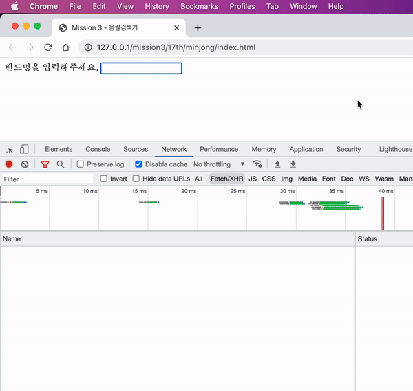

클로저는 자바스크립트에 관심이 있거나 공부를 해본 사람이라면 한 번쯤 들어봤을 것이다.

클로저는 자바스크립트 고유의 특성이 아니라 함수를 일급 객체로 취급하는 언어에서 사용되는 중요한 특성이다. 실제로 자바스크립트의 기반이 되는 ECMAScript 명세에는 클로저에 대한 정의가 없다.

클로저가 뭔지는 알고 있었는데 대부분 문서에서 클로저의 사용예나, 문제점을 반복문과 `setTimeout` 을 이용한 예제가 사용되어 다른 경우는 없을까? 생각하다 궁금해서 글을 작성하게 되었다.

# 클로저(closure)

[MDN](https://developer.mozilla.org/ko/docs/Web/JavaScript/Closures)은 클로저를 아래와 같이 정의한다.

> “A closure is the combination of a function and the lexical environment within which that function was declared.” <br /><br />
> 클로저는 함수와 그 함수가 선언됐을 때의 렉시컬 환경(Lexical environment)과의 조합이다.

클로저를 완벽하게 이해하려면 먼저 스코프에 대한 학습이 진행되어야 한다. 클로저를 이해하는데 좋은 글이 있으니 참고하면 좋을 것 같다.

- [자바스크립트의 스코프와 클로저](https://ui.toast.com/weekly-pick/ko_20160311)

은유법을 이용하여 클로저를 재밌게 설명한 글도 있다.

- [How do JavaScript closures work?](https://stackoverflow.com/a/6472397/19350715)

# 클로저의 활용

그럼 클로저를 어떻게 활용할 수 있을까? 🤔

## debounce

최근에 바닐라 자바스크립트 스터디를 진행했는데, `keyup` 이벤트를 이용해 키 입력이 발생할 때마다 서버로 API 요청을 보내는 미션이 있었다.

`밴드` 라는 단어를 입력하는데 다섯 번의 API 요청이 발생해서 debounce 기법을 통해 이벤트 최적화를 진행했는데, 구현한 `debounce` 함수에도 클로저가 활용됐다.

```jsx
export const debounce = (func, time = 500) => {
  let timeoutId;
  return (...args) => {
    clearTimeout(timeoutId);
    timeoutId = setTimeout(() => func(...args), time);
  };
};
```

```jsx
const searchInput = new SearchInput({
  $target,
  initialState: this.state.keyword,
  onSearch: debounce(async (keyword) => {
    try {
      const url = SEARCH_URL.replace("__keyword__", keyword);
      const results = await request(url);
      const histories = [...this.state.histories];

      if (!histories.includes(keyword)) {
        histories.unshift(keyword);
      }

      if (histories.length >= MAX_HISTORY_COUNT) {
        histories.splice(MAX_HISTORY_COUNT);
      }

      this.setState({ keyword, results, histories });
    } catch (e) {
      console.error(e);
      const nextState = {
        keyword,
        results: [],
        histories: [...this.state.histories],
      };
      this.setState(nextState);
    }
  }, DEBOUNCE_TIME),
});
```

`debounce` 함수가 처음 실행될 때는 `timeoutId` 변수에 값이 할당되지 않고, `debounce` 는 익명 함수로 재할당 된다. 클로저로 인해 상위 스코프에 존재하는 `timeoutId` 에 접근이 가능해지고 `time` 보다 짧은 주기로 호출되면 `setTImeout` 을 통해 초기화시키는 코드다.

아래 사진은 결과물로, 짧은 시간 내에 키 입력이 연속적으로 발생해도 처음 이벤트 하나만 실행된다.



## throttle

debounce와 마찬가지로 클로저를 활용해서 구현할 수 있다.

```jsx
export const throttle = (func, time = 500) => {
  let timeoutId;
  return (...args) => {
    if (!timeoutId) {
      timeoutId = setTimeout(() => func(...args), time);
    }
  };
};
```

## React Hook

리액트 훅에서도 클로저가 활용된다.

`useState` 는 상태와 상태를 변경하는 함수를 요소로 갖는 배열을 반환한다. 아래 코드는 `useState` 를 간략하게 구현한 예이다.

```jsx
function useState(initVal) {
  let _val = initVal;
  const state = () => _val;
  const setState = (newVal) => {
    _val = newVal;
  };
  return [state, setState];
}
const [count, setCount] = useState(1);
console.log(count()); // 1
setCount(2);
console.log(count()); // 2
```

코드를 살펴보면 `state` 를 통해 상위 스코프에 있는 `_val` 을 반환하고, `setState`로 전달받은 매개변수를 `_val` 에 할당한다. 그래서 우리는 호출이 종료된 `useState` 함수 내에 있는 변수에 접근할 수 있었던 것이다.

JSConf.Asia 2019 에서 Shawn Wang 이 발표한 세션이 있으니 참고하자. 직접 훅을 구현하면서 동작하는 방식을 잘 설명하고 있다.

<iframe
  width="768"
  height="500"
  src="https://www.youtube.com/embed/KJP1E-Y-xyo"
  frameborder="0"
  allow="accelerometer; autoplay; encrypted-media; gyroscope; picture-in-picture"
  allowfullscreen
></iframe>

# 마무리

내부에서 선언한 함수가 호출이 종료된 후에도 외부의 변수를 참조하는 어쩌구 저쩌구… 가 아니라 어디에서 어떻게 활용되는지 알게 되니까 딱딱한 개념으로 알고 있었을 때 보다 이해가 잘 됐다. 역시 직접 부딪혀보며 배우는게 제일 효과가 좋은 것 같다.

# 참고

[클로저 - JavaScript | MDN](https://developer.mozilla.org/ko/docs/Web/JavaScript/Closures)

[Closure | PoiemaWeb](https://poiemaweb.com/js-closure)

[자바스크립트의 스코프와 클로저 | TOAST UI](https://ui.toast.com/weekly-pick/ko_20160311)

[Deep dive: How do React hooks really work? | netlify](https://www.netlify.com/blog/2019/03/11/deep-dive-how-do-react-hooks-really-work/)
