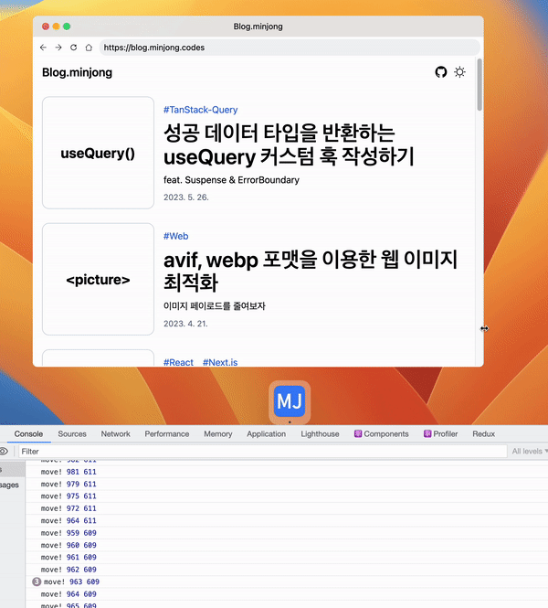
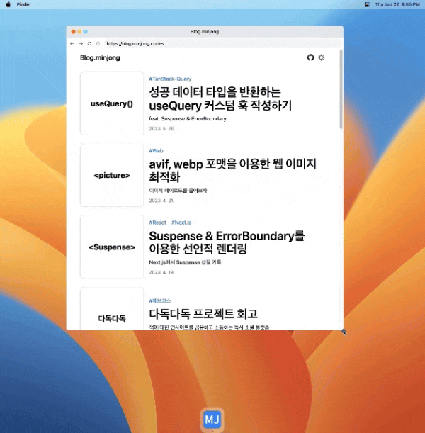

최근에 개인 프로젝트를 진행 하면서 라이브러리의 도움 없이 리사이징 이벤트를 구현했다.

마우스 이벤트 핸들러를 `document` 객체에 등록하고 마우스가 이동하면 좌표를 구해서 컴포넌트를 리사이징 하는데, 아래 그림처럼 마우스가 `iframe` 내부에 위치하면 마우스 이벤트가 사라지는 문제가 있었다.



몇 번 삽질을 하고 쉽게 해결할 수 있는 방법을 찾았다.

# pointer-events

CSS 속성인 `pointer-events`를 사용하면 요소의 마우스 이벤트를 제어할 수 있다. 만약 값으로 `none`을 사용하는 경우 click, hover 와 같은 모든 마우스 관련 이벤트들이 동작하지 않는다.

이벤트가 캡쳐/버블링 되는 특성을 이용해 겹쳐져 보이지 않는 요소의 클릭 이벤트도 처리할 수 있다.

## 드래그 중일 때만 pointer-events 속성을 변경하기

`pointer-events` 값을 `none` 으로 사용하는 경우 위에서 언급한 대로 모든 마우스 관련 이벤트가 동작하지 않는다. 그래서 `iframe` 내부 콘텐츠를 클릭하지 못하는 또 다른 문제가 발생했다.

그래서 mousedown, mouseup 이벤트를 처리할 때 `iframe` 요소를 찾아 `pointer-events` 속성을 변경하도록 구현해서 해결할 수 있었다.

```tsx
const handleMouseDown = (event: MouseEvent, direction: string) => {
  // ...
  windowBodyElement.style.pointerEvents = "none";
};

const handleMouseUp = (event: MouseEvent) => {
  // ...
  windowBodyElement.style.pointerEvents = "auto";
};
```



## 참고

- [MDN - pointer-events](https://developer.mozilla.org/en-US/docs/Web/CSS/pointer-events)
- [stack overflow - Detect mousemove when over an iframe?](https://stackoverflow.com/questions/5645485/detect-mousemove-when-over-an-iframe)
