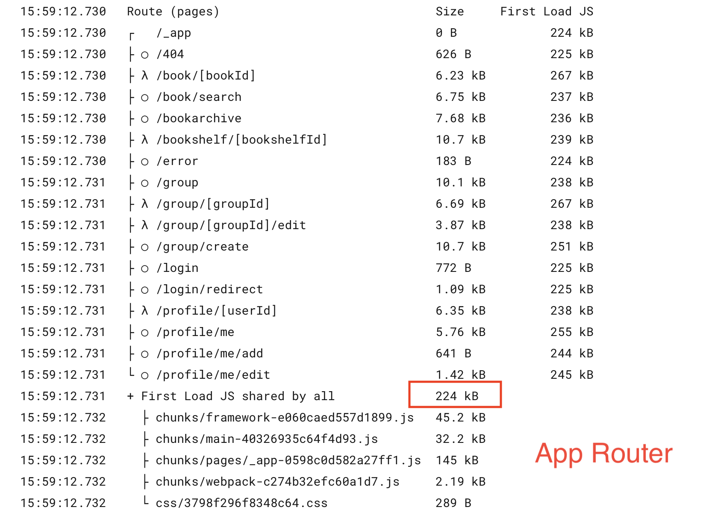
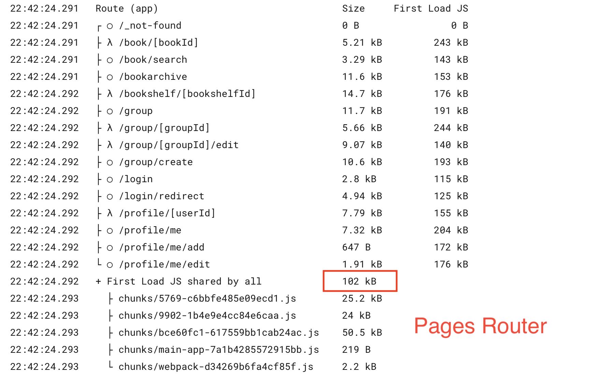

최근에 `Next.js`를 사용하던 프로젝트의 라우팅 방식을 `pages`에서 `app`으로 변경하기만 했는데 JS 번들 사이즈가 절반 가까이 줄어드는 경험을 할 수 있었다.

대부분의 페이지에서도 초기 로드에 필요한 JS 크기가 줄어드는 것도 확인할 수 있었다.

<div className="flex items-center flex-col sm:flex-row gap-2 sm:gap-0">





</div>

`Next.js`는 `app directory`를 통해 리액트 서버 컴포넌트 아키텍처를 지원한다는건 대강 알고 있었는데 리액트 서버 컴포넌트가 도대체 무엇이길래 번들 크기가 절반이나 줄어드는지 궁금해서 학습한 내용을 정리하려 한다.

특히 그동안 나는 서버 컴포넌트와 서버 사이드 렌더링이 비슷하게 사용되는 용어라고 생각했는데 완전히 다른 패러다임이었다.

# 리액트 서버 컴포넌트 (RSC / React Server Components)

리액트 서버 컴포넌트는 React 18에서 추가된 기능이다. 리액트의 [RFC](https://github.com/reactjs/rfcs/blob/main/text/0188-server-components.md)를 보면 리액트 팀은 서버 컴포넌트의 특징을 다음과 같이 이야기 하고 있다.

- 서버에서 실행되어 번들 크기가 제로(0)이며,
- 데이터베이스나 파일 시스템과 같은 서버에 있는 자원에 접근 가능하며,
- 클라이언트 컴포넌트와 통합하여 원활하게 사용 가능하며,
- 점진적으로 렌더링 되어 클라이언트로 스트리밍된다.

그렇다면 왜 리액트 팀은 리액트 서버 컴포넌트를 도입했을까?

## 번들 크기가 제로인 컴포넌트

리액트 팀은 극단적인 예시를 들면서 설명한다. 라이브러리를 사용하는 것은 개발자에게 분명 도움이 되지만 번들 크기가 늘어나서 애플리케이션의 성능 저하로 이어질 수도 있다.

그리고, '세부 정보'와 같은 페이지는 사용자나 기타 엔터티에 대한 정보를 표시하는 경우가 많고 사용자의 상호 작용에 대한 응답으로 업데이트할 필요가 없다고 한다.

이럴 때 서버 컴포넌트를 사용하면 라이브러리를 자유롭게 사용하면서 번들 크기에 영향을 주지 않는 정적인 콘텐츠를 렌더링할 수 있다고 한다.

그래서 뷰 역할만 하는 컴포넌트들의 번들 크기가 줄었기 때문에 초기 로드에 필요한 JS 크기도 줄어든 것이었다.

## 백엔드에 자원에 대한 접근

리액트 팀은 앱을 만들 때 발생하는 일반적인 문제 중 하나로 데이터에 엑세스하는 방법과 데이터의 저장 위치를 결정하는 것이라고 말한다.

일반적으로 사용하는 방법은 더 좋은 UI를 제공하기 위해 클라이언트에서 접근할 수 있는 엔드포인트를 추가로 노출하거나, UI를 염두에 두지 않고 설계된 엔드포인트를 사용해야 한다는 문제가 있다. 이때 서버 컴포넌트를 사용하면 컴포넌트에서 백엔드 자원에 바로 접근할 수 있다.

실제로 다독다독 프로젝트를 진행할 때 특정한 자원에 접근하기 위한 엔드포인트 추가 검토를 백엔드 동료와 이야기했던 경험이 있었다. 엔드포인트를 추가로 만든다는 것이 보안 취약점과 연결될 수 있기에 생각처럼 쉬운 내용은 아니었다.

```jsx
import fs from "fs";

async function Note({ id }) {
  const note = JSON.parse(await fs.readFile(`${id}.json`));
  return <NoteWithMarkdown note={note} />;
}
```

## 클라이언트 - 서버 waterfall

리액트 팀은 성능 저하의 일반적인 원인 중 하나로 애플리케이션이 순차적으로 데이터를 요청할 때 발생한다고 한다.

아래 코드를 살펴보면 Note 컴포넌트가 처음 렌더링 된 이후에 데이터를 로드하고, children 요소들은 데이터가 로드될 때까지 병목 현상이 발생한다.

```jsx
function Note(props) {
  const [note, setNote] = useState(null);
  useEffect(() => {
    // NOTE: 처음 렌더링이 된 이후에 데이터를 로드하고, children 요소들은 데이터가 로드될 때까지 병목 현상이 발생한다.
    fetchNote(props.id).then(noteData => {
      setNote(noteData);
    });
  }, [props.id]);
  if (note == null) {
    return "Loading";
  } else {
    return (/* render note here... */);
  }
}
```

이때 서버 컴포넌트를 사용하면 요청을 서버에서 처리하여 요청 대기시간을 줄이고 성능 향상을 기대할 수 있다. 그리고 컴포넌트 내에서 필요한 최소한의 데이터를 계속해서 가져올 수 있게 된다.

```jsx
async function Note(props) {
  const note = await db.notes.get(props.id);
  if (note == null) {
    // handle missing note
  }
  return (/* render note here... */);
}
```

# 리액트 서버 컴포넌트와 서버 사이드 렌더링은 다르다.

리액트 서버 컴포넌트에 대해 알기 전에는 두 용어 모두 `서버`가 포함되기에 같은 의미에서 사용된다고 생각했다.

서버 컴포넌트와 서버 사이드 렌더링은 다음과 같은 차이점이 있다.

- 서버 컴포넌트는 서버에서 실행되기 때문에 자바스크립트가 클라이언트로 전송되지 않는다. 반면 서버 사이드 렌더링은 모든 컴포넌트 코드가 번들을 통해 클라이언트로 전달된다.
- 서버 컴포넌트는 어느 곳에서나 백엔드에 직접 액세스 가능하다. Next.js의 pages 라우팅은 최상위 레벨에서 `getServerSideProps`을 통해 백엔드에 액세스 가능하다.
- 서버 컴포넌트는 클라이언트 상태를 유지한 채로 refetch 될 수 있다. 서버 사이드 렌더링의 경우 HTML로 전달되기 때문에 refetch가 필요한 경우 HTML 전체를 새로 리렌더링 하므로 클라이언트 상태를 유지할 수 없다.

따라서 서버 컴포넌트는 서버 사이드 렌더링을 대체하는 용도가 아닌, 보완하는 용도로 사용할 수 있다.

# 그 외 알게된 내용들

- `'use client'` 지시문을 사용해서 클라이언트 컴포넌트로 사용하는 경우 하위에 있는 모든 컴포넌트가 클라이언트 컴포넌트가 되는 것이 아니다.
  - 클라이언트에서 React는 서버 컴포넌트의 렌더링 결과를 슬롯(`children`)으로 렌더링하여 클라이언트 컴포넌트와 병합한다.
- [경로 세그먼트](https://nextjs.org/docs/app/api-reference/file-conventions/route-segment-config)를 통해 페이지나 레이아웃의 캐싱을 설정할 수 있다.
- `next/font`는 구글 폰트에서 제공하는 파일에 대한 자체 호스팅이 내장되어 있어 빌드 시 다운로드 되어 정적 자산에 포함된다. 그래서 브라우저에서 구글로 요청을 보내지 않는다.
