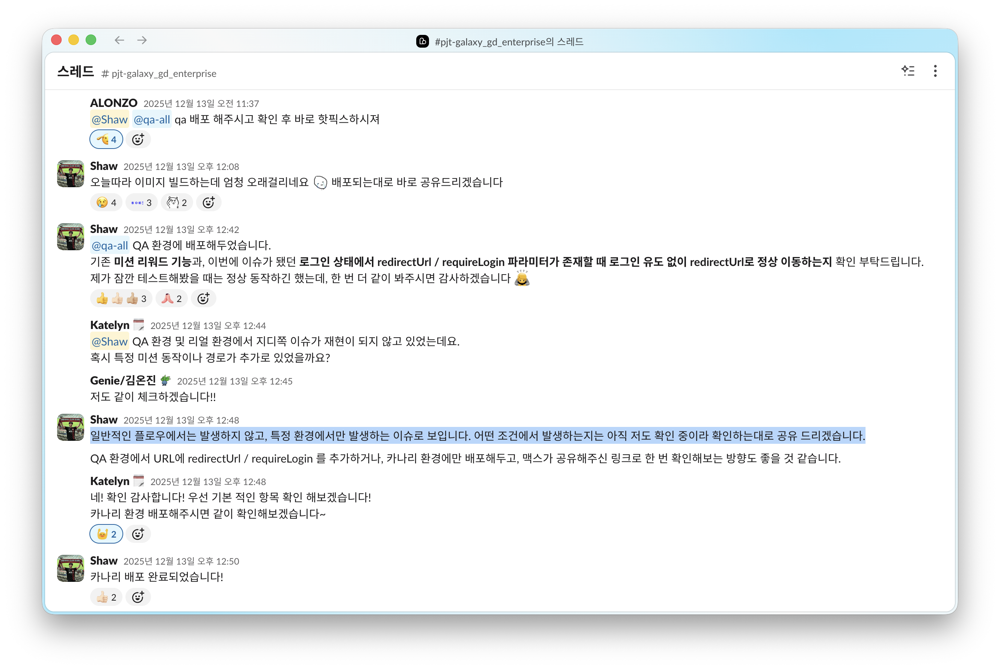

export const metadata = {
  title: "JavaScript는 싱글 스레드인데 Race Condition이 발생한다고?",
  description: "로그인 했는데 자꾸 로그인 유도 팝업이 노출돼요",
  createdAt: "2026-04-21",
  tags: ["JavaScript"],
};

작년 말에 우리 서비스를 이용 중인 아티스트가 진행하는 콘서트에서 QR 코드를 통한 리워드 진행 중 로그인이 되어 있는데도 계속 로그인하라는 팝업이 노출된다는 이슈가 제보됐다.

영향도가 큰 아티스트의 콘서트 기간 + 정확한 증상 재현 어려움 + 주말 대응이라는 환장의 조건으로 원인 분석을 뒤로한 채 우선 정상적으로 리워드를 수령할 수 있도록 임시로 조치하여 핫픽스를 진행했다.



최근에 그동안 쌓인 기술 부채를 청산하면서 이 이슈도 함께 해결했고, 그 기록을 남겨두려 한다.

## 왜 자꾸 로그인 팝업이 노출되었을까?

인증 흐름은 아래와 같다.

1. 보호된 페이지에 접근하면 서버(SSR)에서 쿠키의 Access Token과 Refresh Token을 확인한다.
2. 토큰이 없으면 홈으로 리다이렉트하며 "로그인이 필요합니다" 팝업을 띄운다.
3. 유저가 로그인하면 원래 페이지로 돌아간다.

그렇다면 next 서버가 모종의 이유로 쿠키를 못 읽고 있다고 판단했고, 역시나 로그를 확인해보니 사용자가 로그인한 상태에서 Access Token, Refresh Token 쿠키가 **삭제되고 있었다.** AI와 함께 쿠키가 삭제될 수 있는 구간을 추려보았고, 자세히 분석해보니 원인은 response interceptor에서 발생하는 인터리빙 때문이었다.

### 싱글 스레드에서 race condition?

자바스크립트는 싱글 스레드이지만 여러 `async` 작업이 이벤트 루프를 공유하기 때문에 race condition이 발생할 수 있다. `await`를 만나면 현재 `async` 함수는 **거기서 실행을 멈추고 콜 스택에서 빠진다.** 나머지 코드는 마이크로태스크 큐에 등록되어 대기하고, 그 사이 다른 작업이 실행될 수 있다.

```typescript
async function A() {
  const snapshot = read(); // (1) 상태를 읽고
  await something(); // ← 여기서 실행 양보
  write(snapshot); // (2) 읽은 값을 기준으로 쓴다
}

async function B() {
  write("something else"); // A가 await에 있는 사이에 실행되면?
}
```

두 함수를 거의 동시에 호출하면 실행 순서는 이렇게 엮인다.

```typescript
A();
B();

// 1. A의 read() 실행 → snapshot에 현재 상태 저장
// 2. A가 await에서 실행 양보
// 3. B의 write("something else") 실행 → 공유 상태 변경
// 4. A의 write(snapshot) 실행 → (1)에서 읽은 값을 다시 쓰면서 B의 변경을 덮어쓴다
```

A 함수 하나만 놓고 보면 `(1)` 과 `(2)` 는 연속된 두 줄처럼 보이지만, 그 사이에 B가 실행되면 `(2)` 는 `(1)`에서 읽은 값과 다른 상태 위에서 동작한다. 이렇게 여러 `async` 작업의 실행 구간이 `await`를 경계로 번갈아 섞여서 인터리빙이 발생한다.

싱글 스레드라 두 줄이 물리적으로 동시에 돌진 않지만, 한 함수의 중간중간이 다른 함수로 채워지니 결과는 비슷해진다. 공유 상태를 건드리는 코드가 `await` 전후로 걸쳐 있다면, 그 결과는 인터리빙 순서에 따라 달라진다.

HTTP 요청에선 이 인터리빙이 더 자주 일어난다. `fetch()`의 네트워크 구간은 이벤트 루프 바깥에서 처리되기 때문에 여러 요청이 실제로 병렬로 진행된다. 페이지를 그릴 때 여러 API가 동시에 401을 응답받으면 각 응답 핸들러가 서로의 `await` 사이를 가로질러 실행된다.

```txt
요청 A: fetch → await 응답 대기 ──────────────→ 401 수신 → 갱신 시작
요청 B: fetch → await 응답 대기 ──→ 401 수신 → 쿠키 삭제!
                                                   ↑
                                    A가 await에서 양보한 사이에 실행됨
```

네트워크 요청에 대한 race condition의 경우 우리가 자주 사용하는 TanStack Query나 axios는 내부적으로 `AbortController`를 통해 자동으로 처리하거나, 경합 방지를 위한 수단으로서 제공한다.

우리 서비스는 팀에서 자체적으로 구현한 HTTP Client가 있고, 모든 요청이 이 Client를 거치기 때문에 토큰 갱신도 여기서 공통으로 처리해야 했다. 이를 위해 mutex 기반의 토큰 갱신 로직이 response interceptor에 구현되어 있었다.

### mutex의 구멍

아래는 대략적인 코드이다.

```typescript
if (code === EXPIRED_TOKEN && accessToken) {
  if (context.isLock()) {
    await context.wait(); // 다른 요청이 갱신 중 → 대기
    return true; // 갱신된 토큰으로 재시도
  } else {
    context.lock(); // lock 획득
    const response = await refresh(); // 토큰 갱신
    context.unlock(); // lock 해제
    return true;
  }
} else if (code === NOT_LOGGED_IN) {
  removeCookies([AT, RT]); // lock 체크 없이 즉시 삭제!
}
```

`EXPIRED_TOKEN` 분기는 lock으로 잘 보호되고 있다. 하지만 같은 쿠키를 건드리는 `NOT_LOGGED_IN` 분기는 lock 체크 없이 바로 삭제한다. 공유 자원을 만지는 경로가 두 개인데 mutex는 한 경로에만 걸려 있는 셈이다.

```txt
시간 →

요청 A: 401 (토큰 만료)
  → lock 획득
  → await refresh() ─────── 갱신 중... ──→ 성공!
                                             하지만 RT는 이미 없다

요청 B: 401 (NOT_LOGGED_IN)
  → lock 체크 없음
  → removeCookies([AT, RT]) ← A가 갱신 중인데 쿠키 삭제!
```

요청 A가 `await refresh()`에서 응답을 기다리는 사이, 요청 B가 lock 체크 없이 쿠키를 지우기 때문에 A의 갱신이 성공해도 RT는 이미 사라진 상태다. 그 결과 다음 페이지로 이동하는 순간 서버는 쿠키를 읽지 못하고, 로그인 팝업이 노출되는 것이었다.

콘서트장이라는 네트워크가 불안정한 장소에서 `await refresh()` 구간이 길어졌을 것이고, 그 구간 사이에 다른 요청이 끼어들었을 것으로 생각한다. 그래서 내 개발 환경이나 QA 환경에선 요청 A가 너무 빨리 끝나서 증상이 재현되지 않았던 것으로 추측한다.

### unlock이 보장되지 않는 문제

코드를 더 읽다가 구멍이 하나 더 보였다. `lock()`을 건 뒤 `unlock()`이 수동으로 호출되는 구조였다.

```typescript
context.lock();

const response = await refresh();
if (!response.isSuccess) {
  removeCookies([AT, RT]);
  context.unlock(); // 여기서 unlock
  throw response.error;
}

setCookie(AT, response.data.accessToken);
context.unlock(); // 여기서도 unlock
```

만약 `removeCookies()`나 `setCookie()`에서 예외가 터지면? `unlock()`은 호출되지 않고, 이후 모든 요청이 `await context.wait()`에서 영원히 대기한다.

## 수정

먼저 `lock()` 이후의 로직을 `try/finally`로 감싸서, 중간에 예외가 터지더라도 `unlock()`이 반드시 실행되도록 만들었다.

```typescript
context.lock();
try {
  const response = await refresh();
  if (!response.isSuccess) {
    removeCookies([AT, RT]);
    throw response.error;
  }
  setCookie(AT, response.data.accessToken);
  return true;
} finally {
  context.unlock(); // 어떤 경우에도 실행
}
```

그리고 쿠키를 건드리는 분기에도 lock을 체크하도록 수정해서, 공유 자원에 접근하는 모든 경로를 lock이 통제하도록 만들었다.

```typescript
else if (code === NOT_LOGGED_IN) {
  if (context.isLock()) {
    await context.wait();
    if (isValidToken(getCookie(AT))) {
      return true; // 갱신 성공 → 재시도
    }
  }
  removeCookies([AT, RT]); // 갱신 중이 아닐 때만 삭제
}
```

## 마무리

AI 덕에 구현은 빨라졌지만, 그 결과물을 판단하는 쪽이 오히려 더 중요해진 것 같다. 그리고 이럴 때마다 종종 예전에 학습해둔 CS 지식이 도움이 되는 순간이 있다.

코드를 작성했던 팀원들이 모두 떠난 상황에서, 만약 싱글 스레드에서 race condition이 발생한다는 것을 몰랐다면 AI가 주는 결과물을 판단도 못한 채로 '딸깍'만 반복했을지도 모른다. AI가 의심가는 구간을 발견해줬을 때, 그걸 직접 분석해서 원인을 파악할 수 있었다.

(이제 종종 앱에서 로그인이 풀린다는 이슈도 같이 해소되었길 바라며... 🙏)
