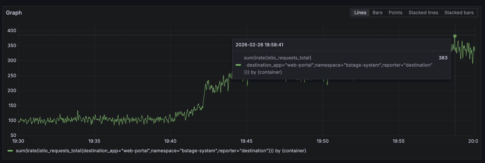

export const metadata = {
  title: "Next.js Dynamic Rendering 환경에서 Data Cache로 서버 부하 줄이기",
  description: "Full Route Cache와 Data Cache는 다른 레이어다",
  createdAt: "2026-03-17",
  tags: ["Next.js"],
};

DevOps로부터 통합 계정 서비스의 CPU 사용률이 계속 올라가고 쓰로틀링이 자주 발생한다는 메시지를 전달받았다.


원인은 [bstage 투표 이벤트](https://bstageplus.com/poll/698ecd18c1bbe47a262c4f4b) 참여가 몰리면서 회원 수가 순식간에 600만명으로 폭증한 것으로, 초당 약 250건이 넘는 가입요청이 지속적으로 들어왔다. 피크 시간대에는 380 건 정도의 요청이 들어왔다. (베트남에서 롤이 이렇게 인기 있는 스포츠인줄 몰랐다...)



## 우리 코드에서 무슨 일이 일어나고 있었는지

이 서비스는 멀티 테넌트 구조라서 요청마다 tenant ID를 받아 해당 테넌트의 이름과 favicon을 메타데이터에 반영해야 하기 때문에 root layout의 `generateMetadata()`에서 테넌트 조회 API를 호출하는 건 필수다.

```typescript
export async function generateMetadata(): Promise<Metadata> {
  const tenantId =
    headers().get(TENANT_ID) || cookies().get(CookieName.TENANT_ID)?.value;

  // 추후 적절한 cache 적용 필요
  const response = await fetch(
    `https://${apiHost}/api/v1/${tenantId}/tenant?locale=${locale}`,
    {
      cache: "no-store",
    },
  );
  // ...
}

export default async function RootLayout({ children }) {
  const headerStore = headers();
  const cookieLanguage = cookies().get(CookieName.LANGUAGE)?.value;
  const loadPath = await getLanguages(isCanary);
  const resources = await preloadI18nResources(loadPath, lang);
  // ...
}
```

문제는 두 가지였다.

**1. `cache: 'no-store'`로 매 요청마다 외부 API 호출**

빠르게 개발하는 상황에서 DEV/QA 환경의 캐시 문제를 해결하기 위해 임시로 `no-store`를 넣었고, `// 추후 적절한 cache 적용 필요` 주석만 남긴 채 그대로 프로덕션까지 배포된 채로 운영되고 있었다. 다국어 지원을 위한 i18n 리소스 fetch에도 캐시 설정이 없었다.

**2. 다국어 처리의 불필요한 복잡성**

언어 감지가 3단계로 되어 있었다.

1. **Middleware**: `accept-language` 헤더를 파싱해서 언어 쿠키에 저장
2. **Root layout**: `cookies()`로 언어 쿠키를 읽어서 i18n 리소스를 프리로딩
3. **ClientProvider**: 클라이언트에서 쿠키를 다시 읽어서 동기화

그런데 계정 서비스에는 언어 변경 UI를 제공하지 않으므로, 브라우저 언어를 기준으로 한 번 결정되면 새로고침 전까지 바뀔 일이 없다. 서버와 클라이언트 간에 동기화할 언어 상태가 없는 셈인데 불필요한 로직이 포함되어 있었다.

결과적으로 모든 페이지가 매 요청마다 `headers()`, `cookies()` 호출로 Dynamic Rendering이 되고, API도 매번 호출하는 구조였다. 임시 조치를 위해 테넌트 조회 요청에 revalidate를 적용하고 불필요한 언어 로직을 개선했다.

임시 조치 이후 CPU 쓰로틀링이 발생하지 않았지만, 곧이어 투표가 종료되는 바람에 아쉽게도 더 자세한 모니터링은 할 수 없었다.

그런데 뒤돌아서 생각해보니, Dynamic Rendering이면 어차피 캐시가 안 될 거라고 생각하고 있었다. 실제로는 다르게 작동한다는 걸 깨닫고 내용을 정리해보았다.

## Next.js 14의 캐시 구조

결론부터 말하면, **Dynamic Rendering과 Data Cache는 다른 레이어다.** `headers()`나 `cookies()`를 호출해서 Dynamic Rendering이 되더라도, 개별 fetch의 Data Cache는 여전히 동작한다. 이걸 이해하려면 Next.js가 fetch를 어떻게 처리하는지 알아야 한다.

### fetch는 어떻게 캐시되는가

Next.js 14 App Router는 서버 컴포넌트에서 호출되는 `fetch`를 전역으로 패치한다. [`packages/next/src/server/lib/patch-fetch.ts`](https://github.com/vercel/next.js/blob/v14.2.29/packages/next/src/server/lib/patch-fetch.ts)에서 원본 fetch를 감싸서 Data Cache 레이어를 끼워 넣는다.

```typescript
// patch-fetch.ts (simplified)
const patched = async (input, init) => {
  const staticGenerationStore = staticGenerationAsyncStorage.getStore();

  // 렌더링 컨텍스트가 없으면 원본 fetch 사용
  if (!staticGenerationStore || staticGenerationStore.isDraftMode) {
    return originFetch(input, init);
  }

  // next: { revalidate } 옵션 읽기
  let curRevalidate = init?.next?.revalidate;

  // cache 옵션과 revalidate 옵션이 동시에 있으면 cache 무시
  if (typeof _cache === "string" && typeof curRevalidate !== "undefined") {
    _cache = undefined;
  }

  // cache 옵션에 따른 revalidate 값 결정
  if (_cache === "force-cache") {
    curRevalidate = false; // 영구 캐시
  } else if (_cache === "no-store") {
    curRevalidate = 0; // 캐시 안 함
  }

  // ...캐시 조회 및 저장 로직
};
```

패치된 fetch는 대략 이런 흐름으로 동작한다.

1. `cache` 옵션 또는 `next.revalidate` 옵션에서 캐시 전략 결정
2. 캐시 키 생성 (URL, method, headers, body를 JSON 직렬화 → SHA-256 해시)
3. Data Cache에서 해당 키로 조회
4. 캐시 히트이고 fresh하면 캐시된 응답 반환
5. 캐시 미스이거나 stale이면 원본 fetch 실행 후 캐시에 저장

실제 저장과 조회는 [`incremental-cache/index.ts`](https://github.com/vercel/next.js/blob/v14.2.29/packages/next/src/server/lib/incremental-cache/index.ts)에서 처리한다.

캐시 키는 URL 기반이므로, 테넌트 조회 API의 경우 URL path에 `tenantId`가 포함되어 테넌트마다 별도의 캐시 엔트리가 생성된다. 계정 서비스 특성상 테넌트는 개별 브랜드가 아닌 계정 사업을 주체하는 사업자 단위여서 수가 비교적 적고, 회원 수가 폭증하더라도 대부분의 요청이 동일한 캐시 엔트리를 히트하게 된다. 만약 테넌트가 수천 개 규모라면 캐시 히트율이 낮아져 효과가 희석될 수 있다.

### Dynamic Rendering과 Data Cache는 독립적이다

`headers()`나 `cookies()`를 호출하면 내부적으로 [`trackDynamicDataAccessed()`](https://github.com/vercel/next.js/blob/v14.2.29/packages/next/src/server/app-render/dynamic-rendering.ts)가 실행된다.

```typescript
// dynamic-rendering.ts (simplified)
function trackDynamicDataAccessed(store, expression) {
  store.revalidate = 0;

  if (store.isStaticGeneration) {
    throw new DynamicServerError(
      `Route couldn't be rendered statically because it used ${expression}`,
    );
  }
}
```

이 함수는 `store.revalidate = 0`을 설정해서 **해당 라우트의 Full Route Cache를 비활성화**한다. 빌드 시점에 HTML을 미리 생성해두는 걸 포기하고, 매 요청마다 서버에서 렌더링하겠다는 뜻이다.

하지만 이건 라우트 수준의 캐시(Full Route Cache)에 대한 것이지, 개별 fetch의 Data Cache와는 무관하다. Next.js의 캐시는 두 레이어로 나뉜다.

|               | Full Route Cache                             | Data Cache                               |
| ------------- | -------------------------------------------- | ---------------------------------------- |
| 캐시 대상     | 렌더링된 HTML/RSC 페이로드 전체              | 개별 fetch 응답                          |
| 비활성화 조건 | `headers()`, `cookies()` 등 Dynamic API 사용 | `cache: 'no-store'` 또는 `revalidate: 0` |
| 단위          | 라우트 전체                                  | fetch 요청별                             |

`headers()`를 호출하면 Full Route Cache는 꺼지지만, 그 안에서 호출하는 각 fetch는 여전히 Data Cache를 사용할 수 있다. 다만 한 가지 예외가 있다.

### autoNoCache

```typescript
// patch-fetch.ts
const autoNoCache =
  (hasUnCacheableHeader || isUnCacheableMethod) &&
  staticGenerationStore.revalidate === 0;
```

fetch에 `authorization`이나 `cookie` 헤더가 포함되어 있고, 현재 라우트가 Dynamic(`store.revalidate === 0`)이면 자동으로 캐시가 꺼진다. 요청에 인증 정보가 포함되어 있으면 응답이 사용자별로 다를 수 있고, 이를 캐시하면 다른 사용자에게 노출될 수 있기 때문이다.

우리 케이스에서 테넌트 조회 API fetch에는 인증 헤더가 없었으므로 이 조건에 해당하지 않았다. **Data Cache를 사용할 수 있는 상태였는데, `cache: 'no-store'`가 명시적으로 막고 있었던 것이다.**

### revalidate의 내부 동작

`next: { revalidate: 1800 }`을 설정하면 어떻게 되는지 보자.

캐시된 응답은 `.next/cache/fetch-cache/`에 다음과 같은 구조로 저장된다.

```typescript
{
  kind: "FETCH",
  data: {
    headers: { ... },
    body: "base64 encoded...",
    status: 200,
    url: "https://..."
  },
  revalidate: 1800,
  tags: [...]
}
```

다음 요청이 들어오면 staleness를 판정한다.

```typescript
// incremental-cache/index.ts
const age = (Date.now() - (cacheData.lastModified || 0)) / 1000;
const isStale = age > revalidate;
```

stale이면 **stale-while-revalidate** 패턴으로 동작한다.

1. 기존 캐시된 응답을 즉시 반환 (사용자는 기다리지 않음)
2. 백그라운드에서 원본 fetch를 실행해서 캐시를 갱신

```typescript
// patch-fetch.ts (simplified)
if (entry.isStale) {
  // 백그라운드에서 재요청
  staticGenerationStore.pendingRevalidates[cacheKey] = doOriginalFetch(
    true,
  ).then(async (response) => ({
    body: await response.arrayBuffer(),
    headers: response.headers,
    status: response.status,
  }));
}
// stale 데이터 즉시 반환
return new Response(Buffer.from(resData.body, "base64"), {
  headers: resData.headers,
  status: resData.status,
});
```

즉, `revalidate: 1800`이면

- 30분 동안은 캐시에서 즉시 반환 (외부 API 호출 없음)
- 30분 경과 후 첫 요청에서 stale 응답을 반환하면서 백그라운드 갱신
- 갱신이 완료되면 다음 30분간 다시 캐시에서 반환

## 해결

`cache: 'no-store'`를 `next: { revalidate: 1800 }`으로 변경하고, 다국어 처리는 쿠키 중계 없이 `accept-language` 헤더를 직접 읽도록 단순화했다.

```typescript
const headerStore = headers();
const acceptLanguage = parsePrimaryLanguage(headerStore.get("accept-language"));
const lang = normalizeLanguage(acceptLanguage) ?? Language.EN;
const resources = await preloadI18nResources(loadPath, lang);
```

## 성능 측정

Data Cache 적용 전후로 로컬에서 `autocannon`을 이용해 부하 테스트를 했다. 프로덕션 빌드(`next build` + `next start`)로 `/login` 페이지에 tenant 헤더를 포함한 요청을 보냈다.

### 단건 요청

|              | Before   | After    |
| ------------ | -------- | -------- |
| 첫 번째 요청 | 653ms    | 1,144ms  |
| 두 번째 요청 | **80ms** | **22ms** |

Before는 `cache: 'no-store'`라서 두 번째 요청도 80ms다. After는 Data Cache 덕분에 두 번째부터 22ms로 72% 줄었다. 첫 번째 요청이 After에서 더 느린 건 캐시 저장 오버헤드 때문으로 보인다.

### 부하 테스트 — 150 동시 접속 (10초)

프로덕션 피크 트래픽(~383 req/s)의 약 40% 수준으로 테스트했다.

| 지표               | Before  | After   | 개선율     |
| ------------------ | ------- | ------- | ---------- |
| 평균 Latency       | 985.7ms | 785.1ms | **-20.4%** |
| p50 Latency        | 935ms   | 584ms   | **-37.5%** |
| Throughput (req/s) | 144.1   | 176.8   | **+22.7%** |

부하가 높을수록 외부 API 호출 제거 효과가 누적되면서 Data Cache 효과가 커진다. p97.5 tail latency는 오히려 올라갔는데, 캐시 미스가 발생하는 소수의 요청(최초 요청, revalidation 트리거 요청)이 원본 fetch와 캐시 저장 오버헤드를 동시에 부담하기 때문으로 보인다.

> 로컬 테스트라서 네트워크 지연, CDN 캐시 등 프로덕션 변수는 반영되지 않았다. 또한 Data Cache는 파일시스템(`.next/cache/fetch-cache/`)에 저장되므로, 프로덕션에서 Pod이 여러 개이면 인스턴스마다 독립적으로 캐시가 생성된다. 즉 인스턴스 수만큼 초기 캐시 미스가 발생할 수 있다. 이 문제는 `next.config.js`의 [`incrementalCacheHandlerPath`](https://nextjs.org/docs/app/api-reference/next-config-js/incrementalCacheHandlerPath) 옵션으로 Redis 같은 공유 캐시 스토어를 연결하면 해결할 수 있다.

## 결론

"어차피 Dynamic Rendering이니까 캐시가 안 되겠지"라고 생각하기 쉬운데, 그건 Full Route Cache에 해당하는 얘기고 개별 fetch의 Data Cache는 별개 레이어로 독립적으로 동작한다.

정말 매 요청마다 fresh한 데이터가 필요한 게 아니라면, `revalidate` 옵션으로 적절한 캐시 주기를 설정하는 게 낫다.

참고로 Next.js 15에서는 fetch의 기본 캐시 동작이 바뀌어서 명시하지 않으면 캐시하지 않는 것이 기본이라고 하니, 버전에 관계없이 fetch의 캐시 옵션을 서비스 목적에 맞게 명시적으로 설정하는 습관이 필요할 것 같다.
