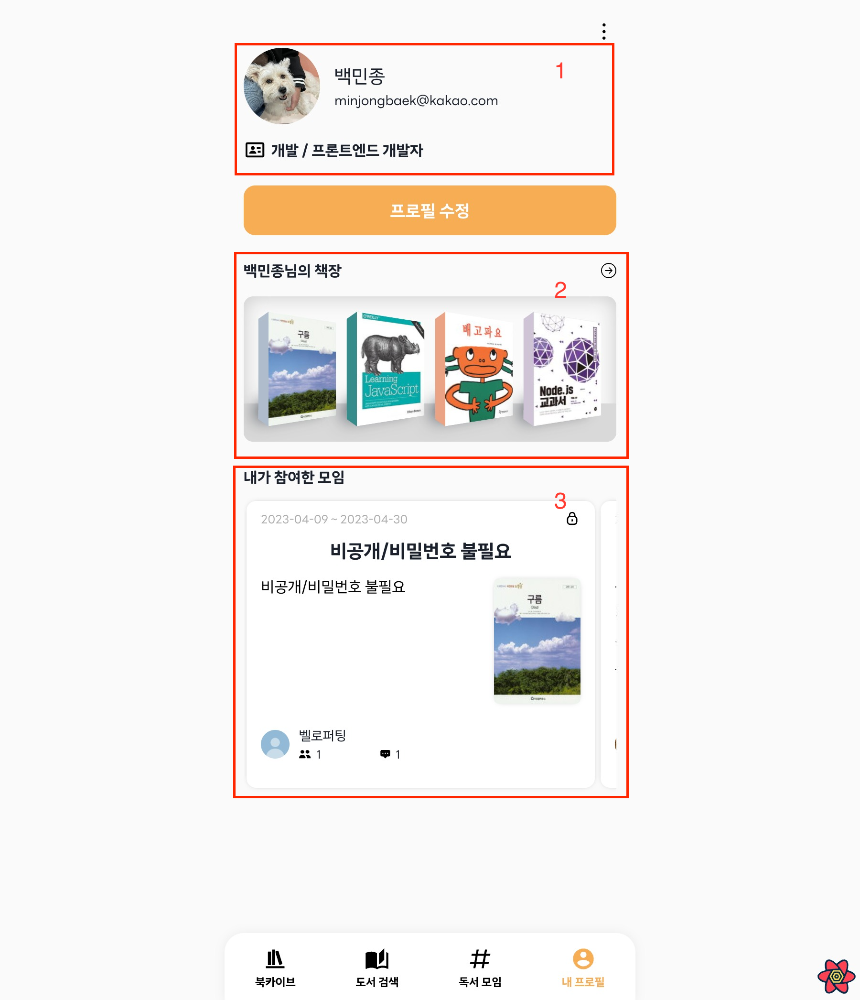
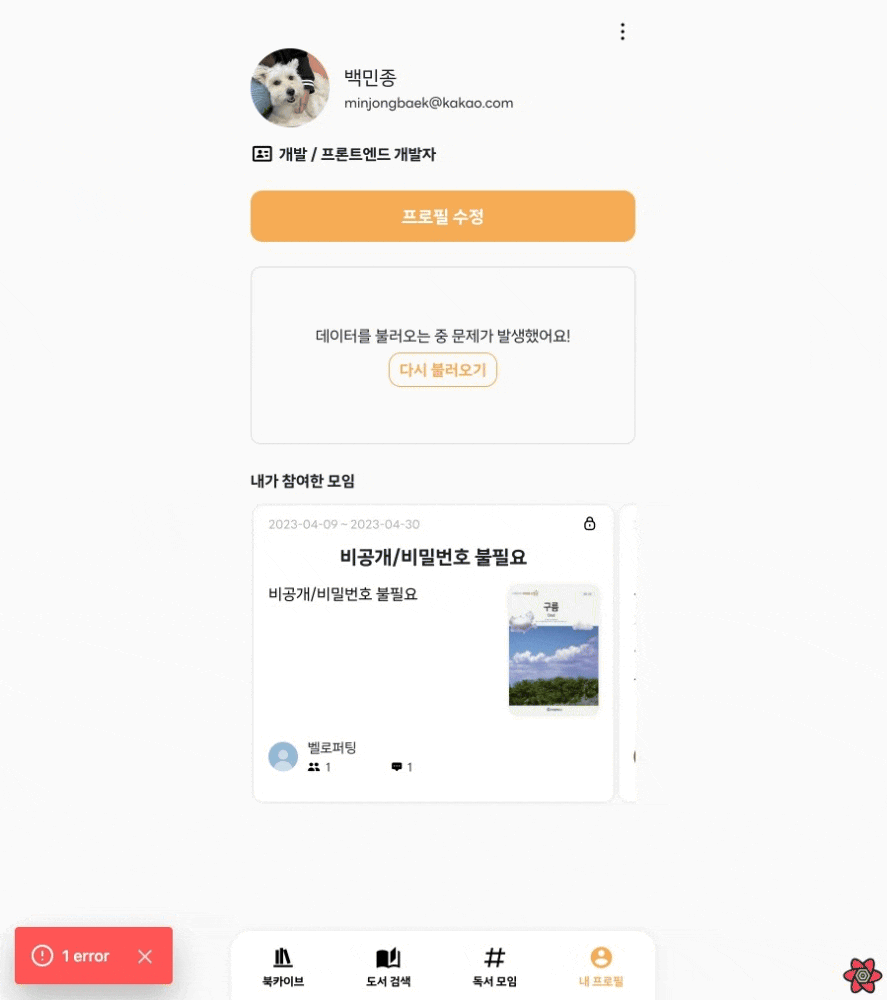

export const metadata = {
  title: "Suspense & ErrorBoundary를 이용한 선언적 렌더링",
  description: "Next.js에서 Suspense 삽질 기록",
  createdAt: "2023-04-19",
  tags: ["React", "Next.js"],
};

최근에 `Suspense`를 도입해서 [다독다독](https://github.com/prgrms-web-devcourse/Team-Gaerval-Dadok-FE) 프로젝트를 리팩터링했다. 그 기록을 남기려고 한다.

## Suspense

**`Suspense`는 렌더링 시간을 예측할 수 없는 상황에 더 나은 사용자 경험을 제공하기 위해 추가된 기능이다.** `Suspense`를 사용하면 데이터를 불러오는 동안에도 UI를 렌더링 하여 사용자에게 적절한 피드백을 줄 수 있다.

특히 컴포넌트를 선언적으로 렌더링 할 수 있다는 특징이 있는데 여기까지 보면 `Suspense`가 없어도 `isLoading`이나 `isSuccess` 같은 상태 변수를 잘 활용하면 해결할 수 있지 않나?라는 생각이 든다.

하지만 여러 데이터를 로드하는 경우에는 어떨까?

아래 코드와 사진은 리팩터링을 하기 전 Profile 컴포넌트인데, 컴포넌트에서 여러 `useQuery`를 사용하는 것을 볼 수 있었다.

```jsx
// 일부 코드는 생략되었습니다.
const MyProfile = () => {
  const userProfileQuery = useMyProfileQuery();
  const bookshelfQuery = useMySummaryBookshelfQuery();
  const groupListQuery = useMyGroupsQuery();
  const { pathname } = useRouter();

  const isSuccess =
    userProfileQuery.isSuccess &&
    bookshelfQuery.isSuccess &&
    groupListQuery.isSuccess;

  const isLoading =
    userProfileQuery.isLoading &&
    bookshelfQuery.isLoading &&
    groupListQuery.isLoading;

  if (isLoading) {
    <Loading />;
  }

  if (isSuccess)
    return (
      <VStack>
        <ProfileInfo {...userProfileQuery.data} />
        <Button
          as={Link}
          href={`${pathname}/edit`}
          scheme="orange"
          fullWidth
          bgColor="main"
          color="white.900"
        >
          프로필 수정
        </Button>
        <ProfileBookshelf {...bookshelfQuery.data} />
        <ProfileGroup {...groupListQuery.data} />
      </VStack>
    );
};
```



**`1. 사용자의 프로필` `2. 사용자의 책장` `3. 사용자가 참여한 모임`** 3개의 데이터를 모두 불러와야 컴포넌트가 렌더링 될 수 있었고, 하나라도 데이터를 불러오지 못한다면 컴포넌트 전체가 렌더링 되지 않는 문제가 있었다.

모든 에러에 대응하여 예외 처리를 하더라도 만약 프로필 페이지에 보여줘야 할 정보가 더 생긴다면 모든 경우의 수를 또 따져서 명령형으로 컴포넌트를 렌더링 해야 하기 때문에 유지 보수가 어렵다는 문제도 있었다.

`Suspense`를 사용하면 관심사를 분리시켜 단일 책임의 원칙도 따를 수 있을 것이라 판단했다.

### Container & Presenter

맨 처음에는 쿼리를 쪼개서 각각의 컴포넌트로 옮기면 되는 거 아닌가? 싶었는데 다른 사용자 프로필에서는 똑같이 보여주는데 수행하는 쿼리가 달라 재사용이 어렵다는 문제가 있었고 (`/users/me`, `/users/[userId]`) 쿼리에 대한 의존성이 너무 높아지는 게 싫었다.

지금 같은 상황에 프로젝트 초기에 도입하려다 실패한 `Container & Presenter` 패턴을 도입한다면 적절할 것 같다고 생각했다.

기존 ProfileInfo 컴포넌트는 전달받은 Props를 기반으로 렌더링 하는 역할만 수행했기 때문에 Presenter 이름만 바꿔주었다.

```tsx
// 일부 코드는 생략되었습니다.
const ProfileInfoPresenter = ({
  nickname,
  oauthNickname,
  profileImage,
  email,
  job: { jobGroupKoreanName, jobNameKoreanName },
}: ProfileInfoProps) => {
  return (
    <VStack>
      <Flex>
        <Avatar src={profileImage} />
        <VStack>
          <Text>{nickname || oauthNickname}</Text>
          <Text>{email}</Text>
        </VStack>
      </Flex>
      <HStack>
        <IconButton />
        <Text>
          {jobGroupKoreanName} / {jobNameKoreanName}
        </Text>
      </HStack>
    </VStack>
  );
};
```

그리고, 다른 사용자의 프로필을 조회하는 2개의 Container를 만들었다.

```tsx
// 일부 코드는 생략되었습니다.
const MyProfileContainer = () => {
  const { isSuccess, data } = useMyProfileQuery({ suspense: true });

  useEffect(() => {
    if (!isSuccess) return;
    // 내 프로필에 특정 정보가 없는 경우에 수행되는 로직
  }, [isSuccess]);

  if (!isSuccess) return null;

  return <ProfileInfoPresenter {...data}></ProfileInfoPresenter>;
};
```

```tsx
// 일부 코드는 생략되었습니다.
const UserProfileInfoContainer = ({
  userId,
}: {
  userId: APIUser["userId"];
}) => {
  const { isSuccess, data } = useUserProfileQuery(userId, { suspense: true });

  if (!isSuccess) return null;

  return <ProfileInfoPresenter {...data}></ProfileInfoPresenter>;
};
```

### Suspense를 이용한 로딩 처리 분리

다음은 Promise가 처리되는 동안 보여줄 fallback 컴포넌트를 작성했다.

```tsx
const ProfileInfoSkeleton = () => {
  return (
    <VStack>
      <SkeletonCircle />
      <Skeleton />
    </VStack>
  );
};
```

그리고, `Suspense`로 Container를 감쌌다. 사용하고 있는 React-Query가 아직 SSR을 완벽하게 지원하지 않기 때문에 클라이언트 사이드인 경우에만 쿼리를 수행하도록 구현했다.

만약 이런 로직이 없다면 Next.js 서버에서 fetch를 시도하게 되는데, 서버와 클라이언트의 axios 설정이 달라서 문제가 생길 수 있다.

그렇다고 suspense 옵션을 활성화하면 무작정 Next.js 서버에서 fetch를 시도하는 것이 아니고, 첫 로딩이 아닌 조건부로 렌더링 되는 컴포넌트에서는 잘 작동된다.

경우에 따라서 되기도 하고 안되기도 해서 이 부분에서 시간을 많이 소요한 것 같다.

```tsx
// 일부 코드는 생략되었습니다.
import { Suspense } from "react";

const ProfileInfo = ({ userId, children }: ProfileInfoProps) => {
  const mounted = useMounted();

  if (!mounted) return null;

  return (
    <Suspense fallback={<ProfileInfoSkeleton />}>
      {userId === "me" ? (
        <MyProfileContainer />
      ) : (
        <UserProfileInfoContainer userId={userId} />
      )}
      {children && children}
    </Suspense>
  );
};
```

### ErrorBoundary를 이용한 에러 처리 분리

`ErrorBoundary`를 이용하면 만약 데이터를 불러오지 못하는 경우에 에러처리를 선언적으로 처리할 수 있다.

react-query를 사용하고 있다면 [QueryErrorResetBoundary](https://tanstack.com/query/v4/docs/react/reference/QueryErrorResetBoundary)와 함께 사용하여 실패한 쿼리를 쉽게 다시 수행할 수 있다.

```tsx
import { Suspense } from "react";
import { QueryErrorResetBoundary } from "@tanstack/react-query";
import { ErrorBoundary } from "react-error-boundary";

const ProfileInfo = ({ userId, children }: ProfileInfoProps) => {
  const mounted = useMounted();

  if (!mounted) return null;

  return (
    <QueryErrorResetBoundary>
      {({ reset }) => (
        <ErrorBoundary
          onReset={reset}
          fallbackRender={({ resetErrorBoundary }) => (
            <QueryErrorBoundaryFallback
              resetErrorBoundary={resetErrorBoundary}
            />
          )}
        >
          <Suspense fallback={<ProfileInfoSkeleton />}>
            {userId === "me" ? (
              <MyProfileContainer />
            ) : (
              <UserProfileInfoContainer userId={userId} />
            )}
            {children && children}
          </Suspense>
        </ErrorBoundary>
      )}
    </QueryErrorResetBoundary>
  );
};
```

## 마무리

`Suspense`와 `ErrorBoundary`를 이용해 컴포넌트의 역할을 명확하게 분리하고 결합도를 낮출 수 있었다.



`Suspense`를 비동기로 데이터를 불러오는 모든 컴포넌트에 적용하는 것이 아니라, 적재적소에 잘 활용하는게 좋을 것 같다. 여러 데이터를 동시에 불러오거나, 결합도를 낮추고 싶을 때, 복잡도를 낮추고 싶을 때 사용하면 좋은 결과를 낼 수 있을 것 같다.

- 자료를 찾아보니 내가 적용한 방법 외에도 다양하게 `Suspense`를 사용할 수 있는 것 같다.
  Next.js에서 제공하는 [Dynamic Import](https://nextjs.org/docs/pages/building-your-application/optimizing/lazy-loading)에는 `React.lazy`와 `Suspense`를 포함하고 있고, dynamic을 사용하면 컴포넌트가 초기 자바스크립트 번들에 포함되지 않고, fallback을 먼저 렌더링 한 뒤에 모든 처리가 완료되면 dynamic 으로 불러온 컴포넌트를 렌더링 할 수 있는 것 같다.
  Next.js 13의 `app/` 디렉터리에서는 [Streaming SSR](https://nextjs.org/docs/app/building-your-application/rendering/server-components)을 이용해 기본적으로 HTML을 스트리밍하는데, `Suspense`와 함께 사용하여 fallback 처리를 할 수 있는 것 같다.
