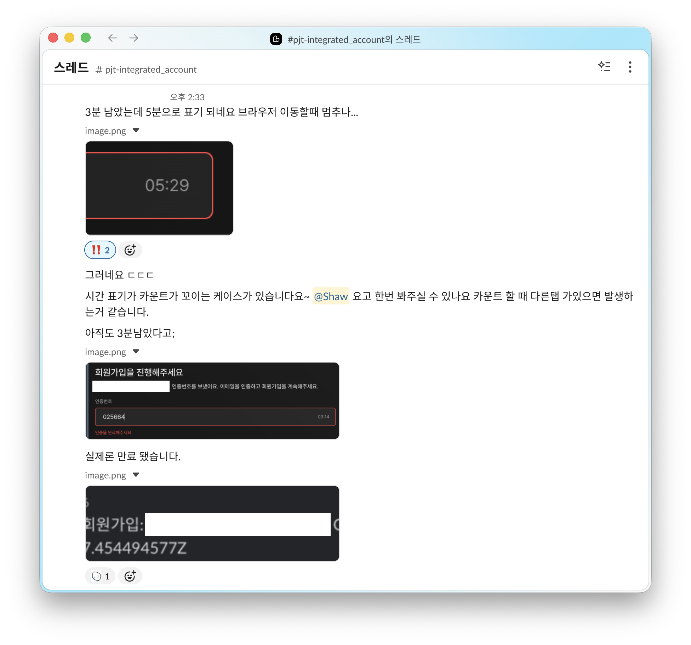

export const metadata = {
  title: "백그라운드 탭에서 타이머가 멈추는 현상 해결하기",
  description: "setInterval 스로틀링과 Date.now() 기반 카운트다운",
  createdAt: "2026-03-10",
  tags: ["JavaScript", "React", "Web"],
};

회원가입 시 이메일 인증 코드 입력 화면에 코드 유효시간 카운트용으로 사용 중인 타이머 컴포넌트가 있는데, 다른 브라우저 탭으로 전환하면 타이머가 멈춘 것처럼 보이는 이슈를 발견했다.



10분 카운트다운 중 다른 탭으로 이동하고 1~2분 후에 다시 돌아오면, 거의 줄어들지 않은 남은 시간이 표시되었다. 분명 시간이 흘렀는데 왜 타이머는 제자리인 걸까?

## 백그라운드 탭에서의 setInterval 스로틀링

브라우저(Chrome 등)는 백그라운드 탭에서 리소스를 절약하기 위해 `setInterval`과 `setTimeout`의 실행을 **늦추거나 건너뛴다.** [MDN의 setTimeout 문서](https://developer.mozilla.org/en-US/docs/Web/API/Window/setTimeout#reasons_for_longer_delays_than_specified)에서도 비활성 탭에서의 타이머 실행 간격을 제한할 수 있다고 명시하고 있다.

실제로 타이머 코드는 아래처럼 매 틱마다 1씩 감소하는 방식으로 구현되어 있었다.

```jsx
const [time, setTime] = useState(600);

useEffect(() => {
  const timer = setInterval(() => {
    setTime((prev) => prev - 1);
  }, 1000);
  return () => clearInterval(timer);
}, []);
```

포그라운드에서는 1초마다 콜백이 호출되어 600 → 599 → 598 순서로 정상 동작한다. 하지만 백그라운드에서는 3초에 한 번, 혹은 그 이상 뜸하게 호출된다. 실제로는 60초가 지났는데 타이머는 20\~30초만 줄어든 것처럼 보이는 것이다.

결국 이 방식은 **"틱이 몇 번 왔는지"** 만 세고 있기 때문에, 실제로 흐른 시간과 화면에 보이는 남은 시간이 어긋나게 된다.

## 끝나는 시각을 기준으로 남은 시간 계산

틱 횟수 대신 **현재 시각(`Date.now()`)** 을 기준으로 남은 시간을 계산하면, 탭이 백그라운드여도 정확한 값을 표시할 수 있다.

타이머가 시작될 때 **끝나는 시각**을 한 번 저장해두고(`endAt = Date.now() + initialSeconds * 1000`), 매 틱마다 현재 시각과의 차이로 남은 초를 계산하는 방식이다. `setInterval`이 백그라운드에서 아무리 느려져도, 다음 tick이 돌 때 `Date.now()`로 다시 계산하기 때문에 그 시점의 **실제 남은 시간**이 반영된다.

```jsx
const endAtRef = useRef(Date.now() + initialSeconds * 1000);

useEffect(() => {
  endAtRef.current = Date.now() + initialSeconds * 1000;
}, [initialSeconds]);

useEffect(() => {
  const tick = () => {
    const remaining = Math.max(
      0,
      Math.ceil((endAtRef.current - Date.now()) / 1000),
    );
    setRemainingSeconds(remaining);

    if (remaining <= 0) {
      onReachZero();
      clearInterval(intervalIdRef.current);
      return;
    }
  };

  const id = setInterval(tick, 1000);
  return () => clearInterval(id);
}, [initialSeconds]);
```

## 탭 복귀 시 즉시 갱신

위 방식으로 남은 시간 자체는 정확해졌지만, 한 가지 더 신경 쓸 부분이 있었다. 백그라운드에서 interval이 한동안 실행되지 않다가 탭으로 돌아온 직후, 다음 tick이 돌기 전까지 **잠깐 동안 이전 값이 표시**될 수 있다는 점이다.

`visibilitychange` 이벤트를 활용해서 탭이 다시 보이는 순간 `tick()`을 한 번 호출해 주면 화면이 바로 갱신된다.

```jsx
useEffect(
  () => {
    const onVisible = () => {
      if (document.visibilityState === "visible") {
        tick();
      }
    };

    document.addEventListener("visibilitychange", onVisible);
    return () => document.removeEventListener("visibilitychange", onVisible);
  },
  [
    /* ... */
  ],
);
```

이렇게 수정한 뒤에는 다른 탭에 갔다가 돌아와도 타이머가 정확하게 동작했다. 타이머이기 때문에 매 초마다 값을 차감하는 것만 생각했었는데, 결국 핵심은 **타이머의 기준을 "틱 횟수"에서 "실제 시각"으로 바꾸는 것**이었다.

### 참고

- [MDN - setTimeout](https://developer.mozilla.org/en-US/docs/Web/API/Window/setTimeout#reasons_for_longer_delays_than_specified)
- [MDN - visibilitychange](https://developer.mozilla.org/en-US/docs/Web/API/Document/visibilitychange_event)
