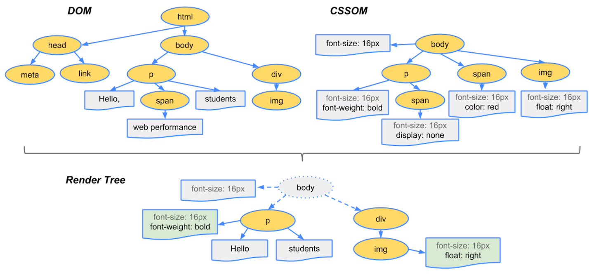

> 브라우저 주소창에 [blog.minjong.codes](http://blog.minjong.codes)을 입력했을 때 어떤 과정을 거쳐 페이지가 화면에 보이게 되는 걸까?

브라우저를 어렸을 때 부터 자연스럽게 사용하고 있었지만 동작 과정에 대해서는 알지 못했다. 이번에 브라우저의 동작 과정에 대해 학습한 내용을 간략하게 정리하고자 한다.

# 렌더링 엔진의 동작 과정

브라우저에 url을 입력하여 서버로 요청을 보내면 서버는 요청에 맞는 응답을 하고, 브라우저의 렌더링 엔진은 응답 받은 내용을 몇가지 과정을 거친 뒤에 브라우저 화면에 표시한다.

## HTML 파싱과 DOM 트리 생성

렌더링 엔진은 `HTML` 코드를 브라우저가 이해할 수 있는 구조로 변환시키기 위해 HTML 파서를 통해 파싱 과정을 거친다. 최종적으로 `HTML` 은 **DOM(Document Object Model)** 로 변환된다.

`DOM` 은 마크업에 정의된 부모 자식 관계를 나타내는 트리 형태의 구조로 되어있다.

파싱이 끝나면 브라우저는 문서와 상호작용할 수 있게 된다.

## CSS 파싱과 CSSOM 트리 생성

`DOM` 트리는 문서 마크업의 속성과 관계를 나타내지만 요소가 렌더링 될 때 어떻게 보여줄지에 대한 정보는 포함되어 있지 않다. **CSSOM(CSS Object Model)** 이 해당 역할을 대신 수행한다.

`CSS` 도 `HTML` 과 마찬가지로 브라우저가 이해할 수 있도록 파싱을 통해 `CSSOM` 로 변환된다.

## 렌더 트리 생성

만들어진 `DOM` 과 `CSSOM` 트리는 **실제 렌더링에 사용될 렌더 트리로 결합** 된다.

결합하는 과정에 **렌더링에 필요하지 않은 일부 노드는 생략** 된다. `<script>` , `<meta>` 와 같은 태그나, `display: none` 속성을 갖는 노드가 이에 해당한다.

💡 `visibility: hidden` 는 요소를 보이지 않게 만들지만 레이아웃에 공간을 차지한다.

## **레이아웃**

만들어진 `렌더 트리`의 각 노드가 각각 **뷰포트 내에서 어떤 정확한 위치와 크기를 갖는지 계산**하는 단계이다.

이 과정에서 모든 상대 측정값은 모두 `px` 단위로 변환된다.

## 페인트

`렌더 트리` 의 **각 노드를 화면에 그리는 단계**이다.

### 동적 변경

브라우저는 변경에 대해 가능한 한 최소한의 동작으로 반응하려고 노력한다. 큰 변경은 앞선 과정을 다시 반복하지만, 요소의 색깔이 바뀌거나 위치가 바뀌는 등의 변경은 변경 대상이 되는 노드의 재배치와 리페인팅이 발생한다.

# 자바스크립트 엔진

**자바스크립트는 렌더링 엔진이 아닌 자바스크립트 엔진에서 처리한다.** HTML 파서는 `<script>` 를 만나면 `DOM` 생성 프로세스를 중지하고 자바스크립트 엔진으로 제어 권한을 넘긴다.

자바스크립트의 실행이 완료되면 다시 HTML 파서로 제어 권한을 넘겨서 브라우저가 중지했던 시점부터 `DOM` 생성을 재개한다.

이것은 `<script>` 의 위치에 따라 블로킹이 발생하여 `DOM` 의 생성이 지연될 수 있다는 것을 의미한다. `<body>` 아래 `<script>` 를 작성하는 이유도 이와 같다.

# 정리

- 서버로 부터 응답받은 HTML, CSS 은 브라우저의 렌더링 엔진을 통해 `DOM` 과 `CSSOM` 트리로 변환된다.
- 생성된 `DOM` , `CSSOM` 트리는 `렌더 트리` 로 결합된다.
- `렌더 트리`의 각 노드는 뷰포트 에서 어떤 위치와 크기를 갖는지 계산된 뒤에 화면에 그려진다.
- 브라우저는 동기적으로 `HTML`, `CSS`, `JavaScript` 를 처리하므로 `<script>` 의 위치는 중요한 의미를 갖는다.

# 참고

- [브라우저는 어떻게 작동하는가? | NAVER D2](https://d2.naver.com/helloworld/59361)
- [브라우저 동작 원리 | PoiemaWeb](https://poiemaweb.com/js-browser)
- [Render-tree Construction, Layout, and Paint | wev.dev](https://web.dev/critical-rendering-path-render-tree-construction/)
