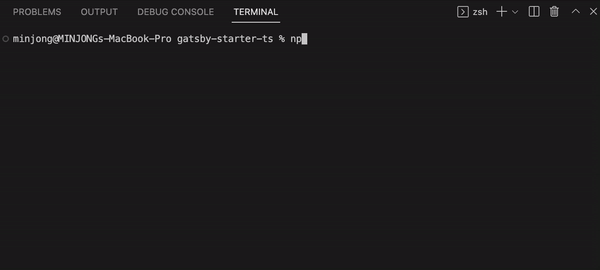
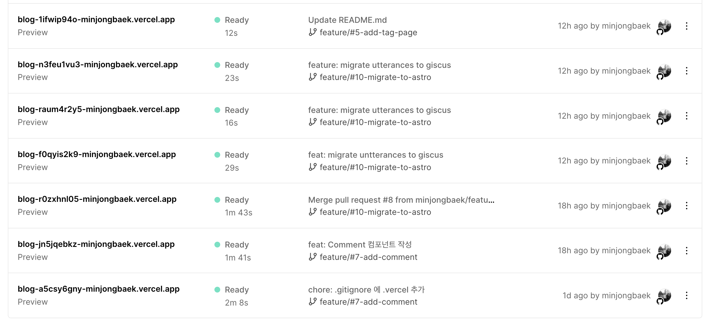

`Gatsby`로 개발했던 블로그를 `Astro`로 전환했다. 내가 왜 마이그레이션을 했고 무엇을 느꼈는지 작성하려한다.

# Why Migrate?

**속도 문제가 제일 컸다.** `Gatsby`는 웹팩을 번들러로 사용하고 있다. `vite`를 한 번 사용해 봤던 나는 웹팩의 개발 속도를 띄우는 속도가 답답하게 느껴졌다. [gatsby-starter-ts](https://github.com/jpedroschmitz/gatsby-starter-ts)에서 처음 개발 서버를 띄울 때 M1 pro를 기준으로 약 4초 정도 소요됐다.

배포할 때는 거의 1분 후반대가 나왔고, 플러그인을 추가하면 2분을 넘기는 일도 잦았다. 작성한 포스트에 오타가 있어서 이를 수정하면 수정된 결과를 보기 위해 거의 2분을 기다려야 했다.

그리고 정적인 콘텐츠를 보여주는 블로그를 하나 만들기 위해 필요한 플러그인과 설정이 많다고 생각했다. 일부 공식 플러그인들의 업데이트가 느리다는 글들을 볼 수 있었고 지속적으로 플러그인들의 버전 관리가 안된다면 곤란한 상황이 올 수 있을 것 같다고 생각했다.

# Why Astro?

`Astro`는 모던한 프론트엔드 기술을 사용하면서 간편하게 정적 사이트를 빌드하기 위해 만들어진 프레임워크로, 콘텐츠 중심의 웹 사이트를 구축하기 위한 all-in-one 웹 프레임워크다. `Astro`의 여러 특징이 있는데 내가 `Astro`를 택한 가장 큰 이유는 **1. 빌드 도구로 `Vite`를 사용**하고 있는 점과 **2. React, Vue, Svelte 등 많은 웹 프레임워크의 컴포넌트를 지원**한다는 점이다.

다른 특징으로는 특별한 점이라면 아일랜드 아키텍처를 도입하여 클라이언트에서 로드하는 자바스크립트의 양이 많이 줄어든다는 것과, MPA 패턴을 적용했다는 것이다.

- https://docs.astro.build/en/concepts/islands
- https://docs.astro.build/en/concepts/mpa-vs-spa

### 아일랜드 아키텍처?

Astro에서 강조하는 기술이다. 웹 페이지를 바다로 보고, 동적인 컴포넌트들을 바다 위에 있는 섬으로 바꾸어 생각하는 패러다임이다. 이렇게 되면 상호작용을 위한 동적인 컴포넌트들을 제외하고 나머지는 정적인 HTML로 대체가 가능하다. 동적인 컴포넌트들은 필요할 때 개별적으로 로드된다.

아일랜드 아키텍처의 가장 큰 장점은 성능에서 확인할 수 있다. 상호작용이 가능한 컴포넌트를 위한 자바스크립트만 포함되기 때문에 자바스크립트의 크기가 줄어든다. 그리고, 모든 정적 콘텐츠가 서버에서 만들어지기 때문에 검색엔진에 최적화되어 있다.

# 후기

기존 리액트로 작성된 컴포넌트를 지원하고, 많은 설정을 해줄 필요도 없어서 빨리 마이그레이션 할 수 있었다. `vite`를 사용하기 때문에 개발 서버를 띄우는 속도도, 배포하는 속도도 매우 빨라졌다.

프론트엔드 기술이 급격하게 발전하면서 단순한 정적 웹사이트를 만들기 위해서도 필요로 하는 지식과 여러 기술이 많아졌다고 생각한다. `Astro`는 상호작용 가능한 동적인 웹사이트를 만드는 데는 적합하지 않을 수 있지만 콘텐츠 중심의 정적인 페이지를 만드는 데는 아주 적합하다고 생각했다.

물론 이제 막 2.0 버전이 릴리즈 되었고 커뮤니티도 크지 않다는 단점이 있지만, 나는 `.astro` 파일을 보면서 전통적인 HTML 코드와 유사하다고 느꼈다. 이런 점이 이제 막 자바스크립트와 HTML을 배운 사람들에게 만드는 것에 집중할 수 있는 환경을 제공해 줄 수 있을 것 같다고 생각한다.
