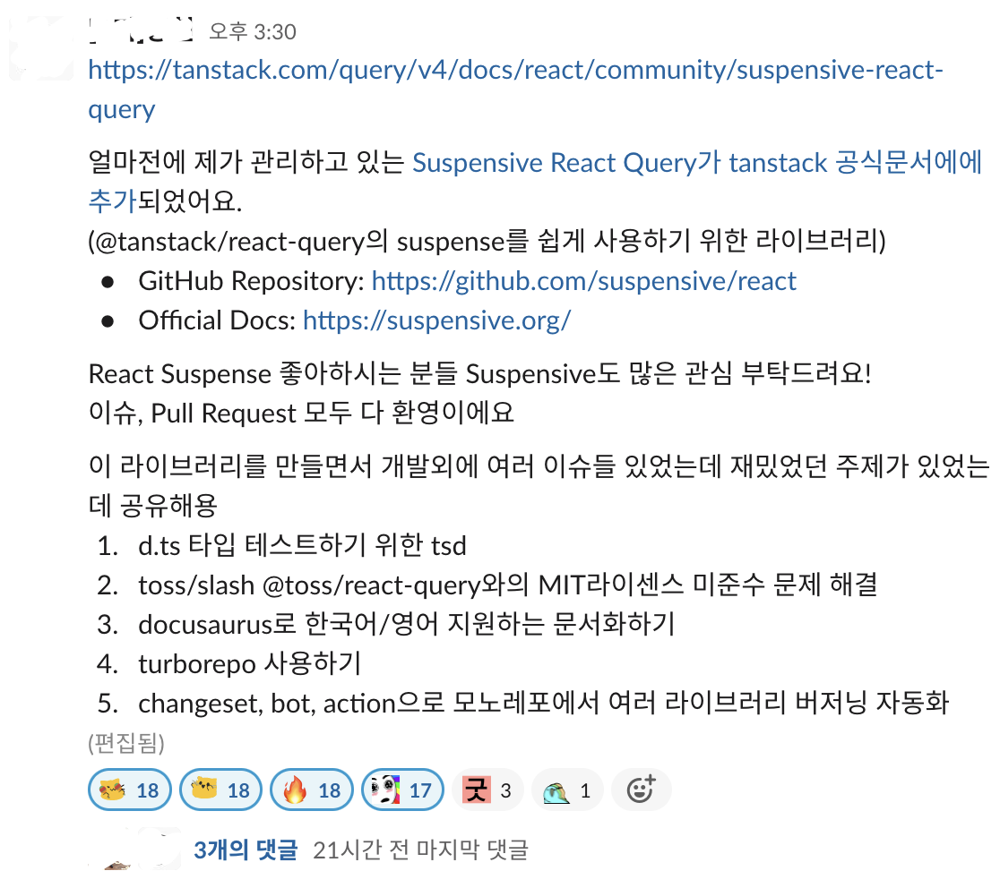

최근 진행한 프로젝트에서 [\<Suspense>와 \<ErrorBoundary>를 이용하여 일부 UI를 선언적으로 렌더링](/post/20230419-fetching-data-declartively)하도록 구현했다.

타입스크립트를 사용한 프로젝트인데 `<Suspense>`와 `<ErrorBoundary>`로 컴포넌트를 감싸도 타입스크립트가 쿼리의 결과가 유효하다는 것을 추론할 수 있게끔 `useQuery()`의 상태가 항상 성공했는지 체크를 해주어야 했다.

```tsx
const Contents = () => {
  const { isSuccess, data } = useQuery({ suspense: true });
  // 데이터를 받아오지 못했다면 fallback UI가 렌더링 될텐데 항상 성공 상태를 가정할 수는 없을까? 🤔
  if (!isSuccess) return null;
  return <Component {...data} />;
};
```

쿼리의 로딩과 에러 상태는 위에서 처리하고 있으니 타입만 수정을 수정하면 될 것이라고 생각해서 항상 `suspense`를 활성화하고 쿼리 데이터를 반환하는 커스텀 훅을 작성했다.

`TanStack-Query`의 `useQuery` 소스 코드를 보고 반환 타입을 재정의 했다.

```ts
import {
  parseQueryArgs,
  QueryFunction,
  QueryKey,
  useQuery,
  UseQueryOptions,
  UseQueryResult,
} from "@tanstack/react-query";

export type useQueryOptionWithOutSuspense<
  TQueryFnData = unknown,
  TError = unknown,
  TData = TQueryFnData,
  TQueryKey extends QueryKey = QueryKey
> = Omit<UseQueryOptions<TQueryFnData, TError, TData, TQueryKey>, "suspense">;

const useQueryWithSuspense = <
  TQueryFnData = unknown,
  TError = unknown,
  TData = TQueryFnData,
  TQueryKey extends QueryKey = QueryKey
>(
  queryKey: TQueryKey,
  queryFunction?: QueryFunction<TQueryFnData, TQueryKey>,
  queryOptions?: useQueryOptionWithOutSuspense<
    TQueryFnData,
    TError,
    TData,
    TQueryKey
  >
) => {
  return useQuery({
    ...parseQueryArgs(queryKey, queryFunction, queryOptions),
    suspense: true,
  }) as UseQueryResult & {
    data: TData;
  };
};

export default useQueryWithSuspense;
```

```tsx
const Contents = () => {
  const { data } = useQuery({ suspense: true });
  return <Component {...data} />;
};
```

## Suspensive

데브코스 1기를 수료한 프롱이분은 이미 나와 비슷한 고민을 했고, 해결하기 위해 아예 라이브러리를 만들어버렸다.

개발자가 Suspense를 편리하게 사용할 수 있도록 만들어진 라이브러리로, 클라이언트 사이드에서만 `children`을 렌더링하는 `<Suspense.CSROnly>` 기능도 제공하고 있다.

단순히 리액트의 개념을 확장한 것으로 다른 패키지에 의존적이도 않고, 최근에는 TasStack-Query의 공식 문서에도 추가되었으니 비슷한 고민을 하고 있다면 사용해 보면 좋을 것 같다.

- [https://suspensive.org](<[suspensive](https://suspensive.org)>)

<div>

<div class="w-[500px]">



</div>

<div className="text-center text-slate-500 italic text-sm">데브코스에는 대단하고 멋진 사람들이 많다...!</div>

</div>
