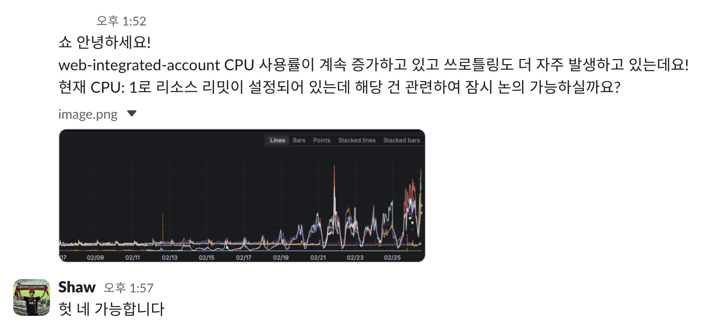

# Next.js App Router에서 fetch 옵션 하나가 만든 차이 — Dynamic Rendering 환경의 Data Cache 활용기

## 배경

통합 계정 서비스(Next.js 14 App Router)에서 CPU 사용률이 계속 올라가고 쓰로틀링이 자주 발생했다. CPU 리소스 리밋은 1이었다.



원인은 [bstage 투표 이벤트](https://bstageplus.com/poll/698ecd18c1bbe47a262c4f4b) 참여가 몰리면서 회원 수가 20만에서 700만으로 폭증한 것이었다. 초당 약 250건 이 넘는 요청이 지속적으로 들어왔다.


## 우리 코드에서 무슨 일이 일어나고 있었는지

root layout을 보면 상황이 보인다.

```typescript
export async function generateMetadata(): Promise<Metadata> {
  const tenantId =
    headers().get(TENANT_ID) || cookies().get(CookieName.TENANT_ID)?.value;

  // 추후 적절한 cache 적용 필요
  const response = await fetch(
    `https://${apiHost}/api/v1/${tenantId}/tenant?locale=${locale}`,
    {
      cache: "no-store",
    },
  );
  // ...
}

export default async function RootLayout({ children }) {
  const headerStore = headers();
  const cookieLanguage = cookies().get(CookieName.LANGUAGE)?.value;
  const loadPath = await getLanguages(isCanary);
  const resources = await preloadI18nResources(loadPath, lang);
  // ...
}
```

이 서비스는 멀티 테넌트 구조라서 요청마다 tenant ID를 받아 해당 테넌트의 이름과 favicon을 메타데이터에 반영해야 한다. `generateMetadata()`에서 tenant API를 호출하는 건 필수다.

문제는 두 가지였다.

**1. `cache: 'no-store'`로 매 요청마다 외부 API 호출**

원래 이 fetch에는 `next: { revalidate: 3600 }`이 적용되어 있었다. 그런데 빠르게 개발하는 상황에서 DEV/QA 환경의 캐시 문제를 해결하기 위해 임시로 `no-store`를 넣었고, `// 추후 적절한 cache 적용 필요` 주석만 남긴 채 그대로 프로덕션까지 올라갔다. i18n 리소스 fetch에도 캐시 설정이 없었다.

**2. 다국어 처리의 불필요한 복잡성**

언어 감지가 3단계로 되어 있었다:

1. **Middleware**: `accept-language` 헤더를 파싱해서 언어 쿠키에 저장
2. **Root layout**: `cookies()`로 언어 쿠키를 읽어서 i18n 리소스를 프리로딩
3. **ClientProvider**: 클라이언트에서 쿠키/`navigator.language`를 다시 읽어서 동기화

그런데 이 서비스에는 언어 변경 UI가 없다. 브라우저 언어를 기준으로 한 번 결정하고, 새로고침 전까지 바뀌지 않는다. 서버와 클라이언트 간에 동기화할 언어 상태가 없는 셈이다.

결과적으로 모든 페이지가 매 요청마다 `headers()`, `cookies()` 호출로 Dynamic Rendering이 되고, 외부 API도 매번 호출하는 구조였다. 여기서 의문이 생겼다 — Dynamic Rendering이면 캐시가 안 되는 게 아닌가?

## Next.js 14의 캐시 구조

결론부터 말하면, **Dynamic Rendering과 Data Cache는 다른 레이어다.** `headers()`나 `cookies()`를 호출해서 Dynamic Rendering이 되더라도, 개별 fetch의 Data Cache는 여전히 동작한다. 이걸 이해하려면 Next.js가 fetch를 어떻게 처리하는지 알아야 한다.

### fetch는 어떻게 캐시되는가

Next.js 14 App Router는 서버 컴포넌트에서 호출되는 `fetch`를 전역으로 패치한다. [`packages/next/src/server/lib/patch-fetch.ts`](https://github.com/vercel/next.js/blob/v14.2.29/packages/next/src/server/lib/patch-fetch.ts)에서 원본 fetch를 감싸서 Data Cache 레이어를 끼워 넣는다.

```javascript
// patch-fetch.js (simplified)
const patched = async (input, init) => {
  const staticGenerationStore = staticGenerationAsyncStorage.getStore();

  // 렌더링 컨텍스트가 없으면 원본 fetch 사용
  if (!staticGenerationStore || staticGenerationStore.isDraftMode) {
    return originFetch(input, init);
  }

  // next: { revalidate } 옵션 읽기
  let curRevalidate = init?.next?.revalidate;

  // cache 옵션과 revalidate 옵션이 동시에 있으면 cache 무시
  if (typeof _cache === "string" && typeof curRevalidate !== "undefined") {
    _cache = undefined;
  }

  // cache 옵션에 따른 revalidate 값 결정
  if (_cache === "force-cache") {
    curRevalidate = false; // 영구 캐시
  } else if (_cache === "no-store") {
    curRevalidate = 0; // 캐시 안 함
  }

  // ...캐시 조회 및 저장 로직
};
```

패치된 fetch는 이런 흐름으로 동작한다:

1. `cache` 옵션 또는 `next.revalidate` 옵션에서 캐시 전략 결정
2. 캐시 키 생성 (URL, method, headers, body를 JSON 직렬화 → SHA-256 해시)
3. Data Cache에서 해당 키로 조회
4. 캐시 히트이고 fresh하면 캐시된 응답 반환
5. 캐시 미스이거나 stale이면 원본 fetch 실행 후 캐시에 저장

캐시된 응답은 `.next/cache/fetch-cache/` 디렉토리에 저장되고, 배포 간에도 유지된다. 저장과 조회는 [`packages/next/src/server/lib/incremental-cache/index.ts`](https://github.com/vercel/next.js/blob/v14.2.29/packages/next/src/server/lib/incremental-cache/index.ts)에서 처리한다.

### Dynamic Rendering과 Data Cache는 독립적이다

`headers()`나 `cookies()`를 호출하면 내부적으로 [`trackDynamicDataAccessed()`](https://github.com/vercel/next.js/blob/v14.2.29/packages/next/src/server/app-render/dynamic-rendering.ts)가 실행된다.

```javascript
// dynamic-rendering.ts (simplified)
function trackDynamicDataAccessed(store, expression) {
  store.revalidate = 0;

  if (store.isStaticGeneration) {
    throw new DynamicServerError(
      `Route couldn't be rendered statically because it used ${expression}`,
    );
  }
}
```

이 함수는 `store.revalidate = 0`을 설정한다. 이것의 의미는 **해당 라우트의 Full Route Cache를 비활성화**하는 것이다. 빌드 시점에 HTML을 미리 생성해두는 걸 포기하고, 매 요청마다 서버에서 렌더링하겠다는 뜻이다.

하지만 이건 라우트 수준의 캐시(Full Route Cache)에 대한 것이지, 개별 fetch의 Data Cache와는 무관하다. Next.js의 캐시는 두 레이어로 나뉜다:

|               | Full Route Cache                             | Data Cache                               |
| ------------- | -------------------------------------------- | ---------------------------------------- |
| 캐시 대상     | 렌더링된 HTML/RSC 페이로드 전체              | 개별 fetch 응답                          |
| 비활성화 조건 | `headers()`, `cookies()` 등 Dynamic API 사용 | `cache: 'no-store'` 또는 `revalidate: 0` |
| 지속 범위     | 재배포 시 초기화                             | 재배포 후에도 유지                       |
| 단위          | 라우트 전체                                  | fetch 요청별                             |

`headers()`를 호출하면 Full Route Cache는 꺼지지만, 그 안에서 호출하는 각 fetch는 여전히 Data Cache를 사용할 수 있다. 다만 한 가지 예외가 있다.

### autoNoCache — 자동으로 캐시가 꺼지는 경우

```javascript
// patch-fetch.js
const autoNoCache =
  (hasUnCacheableHeader || isUnCacheableMethod) &&
  staticGenerationStore.revalidate === 0;
```

fetch에 `authorization`이나 `cookie` 헤더가 포함되어 있고, 현재 라우트가 Dynamic(`store.revalidate === 0`)이면 자동으로 캐시가 꺼진다. 인증 정보가 담긴 응답을 캐시하면 다른 사용자에게 노출될 수 있기 때문이다.

우리 케이스에서 tenant API fetch에는 인증 헤더가 없었으므로 이 조건에 해당하지 않았다. **Data Cache를 사용할 수 있는 상태였는데, `cache: 'no-store'`가 명시적으로 막고 있었던 것이다.**

### revalidate의 내부 동작

`next: { revalidate: 1800 }`을 설정하면 어떻게 되는지 보자.

캐시된 응답은 `.next/cache/fetch-cache/`에 이런 구조로 저장된다:

```javascript
{
  kind: "FETCH",
  data: {
    headers: { ... },
    body: "base64 encoded...",
    status: 200,
    url: "https://..."
  },
  revalidate: 1800,
  tags: [...]
}
```

다음 요청이 들어오면 staleness를 판정한다:

```javascript
// incremental-cache/index.js
const age = (Date.now() - (cacheData.lastModified || 0)) / 1000;
const isStale = age > revalidate;
```

stale이면 **stale-while-revalidate** 패턴으로 동작한다:

1. 기존 캐시된 응답을 즉시 반환 (사용자는 기다리지 않음)
2. 백그라운드에서 원본 fetch를 실행해서 캐시를 갱신

```javascript
// patch-fetch.js (simplified)
if (entry.isStale) {
  // 백그라운드에서 재요청
  staticGenerationStore.pendingRevalidates[cacheKey] = doOriginalFetch(
    true,
  ).then(async (response) => ({
    body: await response.arrayBuffer(),
    headers: response.headers,
    status: response.status,
  }));
}
// stale 데이터 즉시 반환
return new Response(Buffer.from(resData.body, "base64"), {
  headers: resData.headers,
  status: resData.status,
});
```

즉, `revalidate: 1800`이면:

- 30분 동안은 캐시에서 즉시 반환 (외부 API 호출 없음)
- 30분 경과 후 첫 요청에서 stale 응답을 반환하면서 백그라운드 갱신
- 갱신이 완료되면 다음 30분간 다시 캐시에서 반환

## 해결

### 1. Data Cache 적용

`cache: 'no-store'`를 `next: { revalidate: 1800 }`으로 변경했다. i18n 리소스 fetch에도 동일하게 적용했다.

| 서버 처리 항목   | Before                              | After                                |
| ---------------- | ----------------------------------- | ------------------------------------ |
| tenant API 호출  | 매 요청 fetch (`cache: 'no-store'`) | Data Cache 30분 (`revalidate: 1800`) |
| i18n 리소스 로딩 | 매 요청 fetch                       | Data Cache 30분 (`revalidate: 1800`) |

### 2. 다국어 처리 단순화

쿠키 중계 없이 `accept-language` 헤더를 직접 읽도록 바꿨다:

```typescript
const headerStore = headers();
const acceptLanguage = parsePrimaryLanguage(headerStore.get("accept-language"));
const lang = normalizeLanguage(acceptLanguage) ?? Language.EN;
const resources = await preloadI18nResources(loadPath, lang);
```

제거한 것:

- Middleware의 언어 쿠키 설정 로직
- ClientProvider의 `navigator.language` 기반 언어 동기화 useEffect
- `baccount_lang` 쿠키 정책

| 항목      | Before                                                 | After                       |
| --------- | ------------------------------------------------------ | --------------------------- |
| 언어 감지 | 쿠키 3단계 중계 (middleware → cookie → ClientProvider) | `accept-language` 직접 읽기 |

## 성능 측정

로컬에서 `autocannon`으로 Before/After 부하 테스트를 했다. 프로덕션 빌드(`next build` + `next start`)로 `/login` 페이지에 tenant 헤더를 포함한 요청을 보냈다.

### 단건 요청

|              | Before   | After    |
| ------------ | -------- | -------- |
| 첫 번째 요청 | 653ms    | 1,144ms  |
| 두 번째 요청 | **80ms** | **22ms** |

Before는 `cache: 'no-store'`라서 두 번째 요청도 80ms다. After는 Data Cache 덕분에 두 번째부터 22ms로 72% 줄었다. 첫 번째 요청이 After에서 더 느린 건 캐시 저장 오버헤드 때문이다.

### 부하 테스트 — 150 동시 접속 (10초)

프로덕션 피크 트래픽(~383 req/s)의 약 40% 수준으로 테스트했다.

| 지표               | Before  | After   | 개선율     |
| ------------------ | ------- | ------- | ---------- |
| 평균 Latency       | 985.7ms | 785.1ms | **-20.4%** |
| p50 Latency        | 935ms   | 584ms   | **-37.5%** |
| Throughput (req/s) | 144.1   | 176.8   | **+22.7%** |

부하가 높을수록 외부 API 호출 제거 효과가 누적되면서 Data Cache 효과가 커진다. p97.5 tail latency는 오히려 올라갔는데, 대부분의 요청이 빨라지면서 동시 인입량이 늘고 일부가 큐잉되기 때문이다.

> 로컬 테스트라서 네트워크 지연, CDN 캐시 등 프로덕션 변수는 반영되지 않았다.

## 마무리

이번 작업의 핵심은 단순하다. `cache: 'no-store'`를 `next: { revalidate: 1800 }`으로 바꾼 것이다.

Dynamic Rendering 환경에서도 Data Cache는 동작한다. `headers()`나 `cookies()`를 사용해서 Full Route Cache가 꺼지더라도, 개별 fetch의 Data Cache는 별개 레이어로 독립적으로 동작한다. "어차피 dynamic이니까 캐시가 안 되겠지"라고 생각하기 쉬운데, 그건 Full Route Cache에 해당하는 얘기다.

`cache: 'no-store'`는 버그를 빠르게 해결하기 위한 임시 조치로 들어가기 쉽다. 우리도 favicon 캐시 문제를 해결하면서 넣었고, 주석만 남긴 채 트래픽 폭증 시점까지 방치됐다. 정말 매 요청마다 fresh한 데이터가 필요한 게 아니라면, `revalidate` 옵션으로 적절한 캐시 주기를 설정하는 게 낫다.

참고로 Next.js 15에서는 fetch의 기본 캐시 동작이 바뀌었다. 14에서는 명시하지 않으면 `force-cache`(영구 캐시)였지만, 15부터는 캐시하지 않는 것이 기본이다. 버전에 관계없이 fetch의 캐시 옵션을 명시적으로 설정하는 습관이 필요하다.
